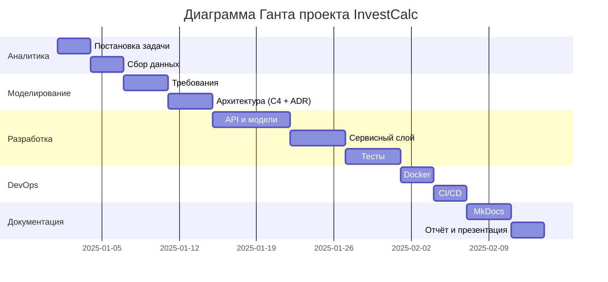

# Gantt Chart — Диаграмма Ганта проекта InvestCalc

## 1. Назначение
Диаграмма Ганта показывает планируемую последовательность выполнения задач проекта.

---

## 2. График (Mermaid)

```mermaid
gantt
    title Диаграмма Ганта проекта InvestCalc
    dateFormat  YYYY-MM-DD

    section Аналитика
    Постановка задачи          :a1, 2025-01-01, 3d
    Сбор данных                :a2, after a1, 3d

    section Моделирование
    Требования                 :b1, after a2, 4d
    Архитектура (C4 + ADR)     :b2, after b1, 4d

    section Разработка
    API и модели               :c1, after b2, 7d
    Сервисный слой             :c2, after c1, 5d
    Тесты                      :c3, after c2, 5d

    section DevOps
    Docker                     :d1, after c3, 3d
    CI/CD                      :d2, after d1, 3d

    section Документация
    MkDocs                     :e1, after d2, 4d
    Отчёт и презентация        :e2, after e1, 3d
```