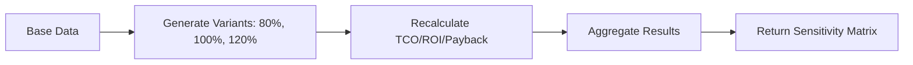

# Business Rules — Бизнес-правила системы InvestCalc

Документ содержит формализованные бизнес-правила для расчётов экономической эффективности информационных систем. Все правила обязательны к использованию при реализации бизнес-логики (`src/services/invest_service.py`) и отражены в тестах (`tests/test_service.py`, `tests/test_sensitivity.py`).

---

## 1. Назначение документа

Цель документа — определить:
- математические правила,
- ограничения,
- формулы,
- бизнес-логику,
- требования к округлению,
- правила сравнения сценариев,
- правила анализа чувствительности.

Бизнес-правила являются основой для:
- расчётов (`calculate_all`, `calculate_tco`, `calculate_roi`, `calculate_payback`);
- анализа данных;
- формирования отчётов;
- проектирования моделей (`models/invest.py`);
- тестирования.

---

## 2. Основные входные параметры

Система оперирует следующими параметрами:

| Параметр | Тип | Описание | Ограничение |
|---------|-----|-----------|-------------|
| CAPEX   | float | Капитальные затраты | CAPEX ≥ 0 |
| OPEX    | float | Ежегодные операционные затраты | OPEX ≥ 0 |
| Period  | int   | Период анализа (в годах) | Period ≥ 1 |
| Effect  | float | Годовой экономический эффект | Effect ≥ 0 |

Все ограничения формализованы в Pydantic моделях (см. ADR-04).

---

## 3. Формулы и бизнес-логика

## 3.1. Бизнес-правило BR-01: Расчёт TCO (Total Cost of Ownership)

**Описание:**  
Полная стоимость владения за период анализа.

**Формула:**

```

TCO = CAPEX + (OPEX × Period)

```

**Ограничения:**
- TCO ≥ CAPEX
- Период учитывается полностью, дробные значения запрещены.

**Требуемая точность:**
- округление до 2 знаков после запятой.

---

## 3.2. Бизнес-правило BR-02: Расчёт ROI (Return on Investment)

**Описание:**  
Показывает рентабельность инвестиций.

**Формула:**

```

ROI = ((Effect × Period) - TCO) / TCO × 100%

```

Где:
- `Effect × Period` — суммарный экономический эффект.

**Требуемая точность:**
- ROI округляется до 2 знаков после запятой.

**Особые случаи:**
- Если CAPEX = 0 и OPEX = 0 → ROI = 0 (избегаем деления на ноль).
- Если TCO = 0 (теоретически) → ROI = 0.

---

## 3.3. Бизнес-правило BR-03: Расчёт Payback Period (Срок окупаемости)

**Описание:**  
Количество лет, за которое эффект покрывает расходы.

**Правило:**
- если `(Effect × Period) < TCO`, проект **не окупается**.

**Тогда:**
```

Payback = null

```

**Если окупается:**
```

Payback = TCO / Effect

```

**Точность:**
- округляется до 2 знаков после запятой;
- но в отчётах можно отображать с 1 знаком (на усмотрение автора).

---

## 3.4. Бизнес-правило BR-04: Определение экономической целесообразности проекта

Проект считается **экономически эффективным**, если:

```

ROI > 0

```

или эквивалентно:

```

(Effect × Period) > TCO

```

---

## 4. Анализ чувствительности

Анализ чувствительности выполняется по ±20% ключевых параметров (по умолчанию для CAPEX и OPEX).

---

## 4.1. Бизнес-правило BR-05: Проверка диапазонов вариации

Для каждого параметра X формируются значения:

```

X_low  = X × 0.8
X_base = X
X_high = X × 1.2

```

Параметры:
- CAPEX
- OPEX
- (опционально) Effect

---

## 4.2. Бизнес-правило BR-06: Пересчёт метрик для каждого варианта

Для каждой вариации пересчитываются:
- TCO  
- ROI  
- Payback  

---

## 4.3. Бизнес-правило BR-07: Требования к структуре результата

Ответ должен содержать:

```json
{
  "parameter": "capex",
  "values": [
    { "variant": "low",  "capex": "...", "tco": "...", "roi": "...", "payback": "..." },
    { "variant": "base", "capex": "...", "tco": "...", "roi": "...", "payback": "..." },
    { "variant": "high", "capex": "...", "tco": "...", "roi": "...", "payback": "..." }
  ]
}
```

Все значения должны соблюдаться согласно правилам BR-01 — BR-04.

---

## 5. Сравнение сценариев

## 5.1. Бизнес-правило BR-08: Определение предпочтительного сценария

Сценарий считается предпочтительным, если:

```
ROI > ROI другого сценария
```

Если ROI равны:

* использовать TCO → меньшее значение лучше.

Если TCO равны:

* использовать Payback → меньшее значение лучше.

---

## 5.2. Бизнес-правило BR-09: Требования к структуре сравнения

Результат должен содержать:

```json
{
  "local": { ... },
  "cloud": { ... },
  "recommended": "local" | "cloud" | "equal",
  "justification": "string"
}
```

Где выбор `recommended` должен базироваться на BR-08.

---

## 6. Требования к округлению

| Бизнес-метрика | Точность |
| -------------- | -------- |
| TCO            | 2 знака  |
| ROI (%)        | 2 знака  |
| Payback        | 2 знака  |

Правила округления:

* Использовать стандартное округление `round(value, 2)`.
* При экспорте в HTML допускается форматирование до 1–2 знаков.

---

## 7. Требования к обработке ошибок

## 7.1. Неверные входные данные

При нарушении ограничений (отрицательные значения, неверные типы) система должна:

* вернуть ошибку 400,
* указать поле и причину,
* не выполнять расчёты.

---

## 7.2. Невозможность окупаемости

Если проект не окупается:

* Payback = null,
* поле `is_profitable` = false,
* ROI может быть отрицательным.

---

## 8. Diagrams — схема бизнес-логики (Mermaid)

## 8.1. Диаграмма расчётов

```mermaid
flowchart TD
    A[Input Data] --> B(TCO = CAPEX + OPEX × Period)
    B --> C(ROI = ((Effect × Period) - TCO) / TCO × 100%)
    C --> D{Effect × Period ≥ TCO?}
    D -- Нет --> E[Payback = null<br/>Project Not Profitable]
    D -- Да --> F[Payback = TCO / Effect]
    F --> G[Return Result]
    E --> G[Return Result]
```

---

## 8.2. Диаграмма анализа чувствительности



