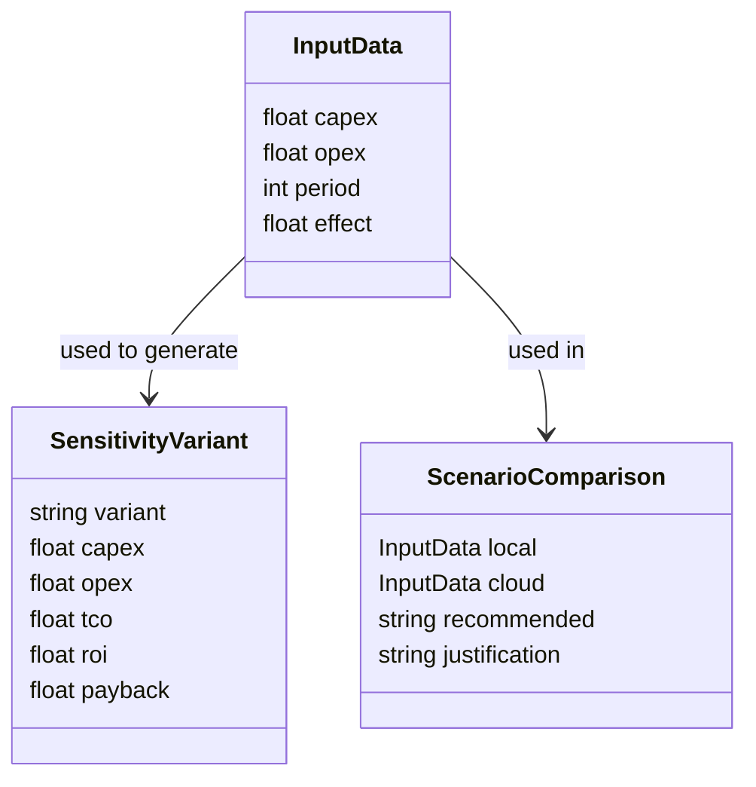

# Data Requirements — Требования к данным системы InvestCalc

Документ описывает все требования к структуре данных, входным моделям, сценариям, форматам JSON, ограничениям на типы и значения. Требования обязательны для реализации моделей (`src/models/`) и сервисов (`src/services/`), а также для тестирования.

---

## 1. Назначение документа

Цель документа — сформировать единые стандарты данных, используемых InvestCalc:

- формат входных данных;
- формат сценариев (JSON-файлов);
- требования к валидации;
- правила хранения данных;
- правила преобразования данных;
- требования к структуре выходных данных.

Документ является основой для:
- моделей Pydantic;
- сервисного слоя;
- анализа чувствительности;
- сравнения сценариев;
- тестов API.

---

## 2. Общие требования к данным

### 2.1. Формат данных
Система InvestCalc использует **только JSON** как формат входных и выходных данных.

JSON должен соответствовать структурам Pydantic-моделей.

---

### 2.2. Кодировка
- UTF-8 для всех файлов `.json`, `.md`, `.html`.

---

### 2.3. Требования к целостности
- Все поля должны присутствовать (никаких пропусков).
- Отсутствие лишних полей (строгая валидация Pydantic).
- Невозможно передать «мусорные» данные — запрос должен быть отклонён.

---

## 3. Требования к структуре входных данных

Основная модель входных данных:

```json
{
  "capex": 1000000,
  "opex": 200000,
  "period": 5,
  "effect": 400000
}
```

### 3.1. Поля и ограничения

| Поле   | Тип   | Обязательное | Ограничение | Комментарий                    |
| ------ | ----- | ------------ | ----------- | ------------------------------ |
| capex  | float | Да           | capex ≥ 0   | капитальные затраты            |
| opex   | float | Да           | opex ≥ 0    | ежегодные операционные затраты |
| period | int   | Да           | period ≥ 1  | количество лет анализа         |
| effect | float | Да           | effect ≥ 0  | годовой эффект                 |

---

### 3.2. Логические ограничения

* `period` должен быть целым числом; дробные значения запрещены.
* Если `effect = 0`, проект теоретически не может окупиться.
* Любой параметр, равный `null`, считается ошибкой.

---

### 3.3. Требования к типам

* `int` → только целые числа (например, `period`).
* `float` → допускается как целое, так и дробное число.
* Строки, булевы значения, объекты — не принимаются вместо чисел.

---

## 4. Требования к структуре сценарных данных (JSON-файлы)

Сценарии находятся в директории:

```
data/input-local.json
data/input-cloud.json
data/samples/*.json
```

### 4.1. Структура сценария

Структура идентична структуре входных данных:

```json
{
  "capex": 300000,
  "opex": 80000,
  "period": 3,
  "effect": 150000
}
```

### 4.2. Требования к содержимому файлов

* Сценарии должны быть валидными JSON-документами.
* Комментарии в JSON запрещены.
* Числа должны быть реальными числовыми типами (не строками `"10000"`).
* Сценарии должны проходить валидацию Pydantic-модели при загрузке.

---

### 4.3. Набор тестовых сценариев

В каталоге `data/samples/` должны находиться:

* `scenario1.json`
* `scenario2.json`

Они используются в тестах для проверки:

* корректности чтения файлов,
* правильности расчётов,
* сравнения сценариев,
* анализа чувствительности.

---

## 5. Требования к структуре выходных данных

### 5.1. Структура результата базового расчёта

```json
{
  "capex": 1000000,
  "opex": 200000,
  "period": 5,
  "effect": 400000,
  "tco": 2000000,
  "roi": 100,
  "payback": 2.5,
  "is_profitable": true
}
```

#### Требования:

* Все вычисленные значения должны быть округлены согласно business-rules.md.
* Поле `is_profitable` обязательно.

---

### 5.2. Структура результата анализа чувствительности

```json
{
  "parameter": "capex",
  "values": [
    {
      "variant": "low",
      "capex": 800000,
      "tco": 1800000,
      "roi": 133.33,
      "payback": 2.25
    },
    {
      "variant": "base",
      "capex": 1000000,
      "tco": 2000000,
      "roi": 100,
      "payback": 2.5
    },
    {
      "variant": "high",
      "capex": 1200000,
      "tco": 2200000,
      "roi": 66.67,
      "payback": 2.75
    }
  ]
}
```

---

### 5.3. Структура результата сравнения сценариев

```json
{
  "local": { ... },
  "cloud": { ... },
  "recommended": "local",
  "justification": "Local scenario provides lower TCO and higher ROI"
}
```

---

## 6. Требования к валидации данных

### 6.1. Типизация

Валидация проводится:

* через Pydantic-модели (`BaseModel`);
* проверки значений внедряются через `Field(ge=0, ...)`;
* ошибки валидации должны возвращать статус 400.

---

### 6.2. Ошибки должны быть структурированы

Пример ответа:

```json
{
  "error": "Invalid input",
  "details": [
    {
      "loc": ["capex"],
      "msg": "Value must be >= 0",
      "type": "value_error"
    }
  ]
}
```

---

### 6.3. Ограничения данных

* отрицательные значения → ошибка;
* null → ошибка;
* пустой JSON → ошибка;
* неверная структура → ошибка.

---

## 7. Требования к хранению данных

### 7.1. Хранилище сценариев

Расположение:

```
data/input-local.json
data/input-cloud.json
data/samples/
```

### 7.2. Требования

* запись/модификация сценариев осуществляется только разработчиками;
* API не должно изменять файлы — только читать;
* JSON-файлы должны быть версионно контролируемы (Git).

---

## 8. Требования к расширению структуры данных

Система должна позволять расширять модель данных:

* добавление новых параметров расчётов,
* добавление категорий затрат (например, SupportCost, IntegrationCost),
* добавление альтернативных сценариев,
* ввод дополнительных метрик.

Расширения описываются в ADR-14 (architectural extension path).

---

## 9. Диаграмма данных (Mermaid)



