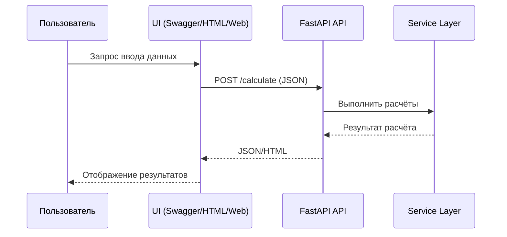

## UI Requirements — Требования к пользовательскому интерфейсу InvestCalc

Документ определяет требования к интерфейсу пользователя (UI/UX) для системы InvestCalc.  
Несмотря на то, что базовая версия системы является REST API, UI присутствует в виде:

- Swagger UI / Redoc документации,
- HTML-отчёта,
- и потенциального будущего Web UI (расширенная версия).

Документ описывает требования ко всем уровням интерфейса.

---

## 1. Назначение

UI-требования определяют:

- набор интерфейсов, доступных пользователю;
- требования к их структуре, содержанию, доступности;
- принципы взаимодействия;
- требования к отчётам;
- требования к визуальному представлению данных.

Документ обязателен для разработчиков, тестировщиков и технических писателей.

---

## 2. Пользователи интерфейса

Интерфейс ориентирован на:

- **Студентов** — используют API и отчёты в учебной практике.
- **Преподавателей** — проверяют работу системы и отчётов.
- **Внешние системы** — используют Swagger/OpenAPI для интеграции.
- **Разработчиков** — проверяют интерфейсы при разработке.

---

## 3. Требования к Swagger UI / Redoc

Swagger — основной UI для взаимодействия с API.  

## 3.1. Общие требования

- Swagger UI должен автоматически генерироваться из FastAPI.
- Интерфейс должен быть доступен по адресу:
```

[http://localhost:8000/docs](http://localhost:8000/docs)
[http://localhost:8000/redoc](http://localhost:8000/redoc)

```
- Интерфейс должен быть читаемым, понятным и структурированным.
- Должны быть отображены:
- все эндпоинты;
- схемы запросов/ответов;
- модели данных;
- примеры.

## 3.2. Требования к удобству использования

- Простейший тест должен выполняться в 1–2 клика.
- Все модели данных обязаны иметь:
- описания полей;
- типы;
- пример JSON.

## 3.3. Требования к отображению ошибок

- В случае ошибок запроса Swagger должен показывать содержимое ответа (400/422/500).

---

## 4. Требования к HTML-отчёту (Report UI)

HTML-отчёт — основной пользовательский интерфейс для восприятия результатов анализа.

Отчёт генерируется по эндпоинту:

```

GET /api/v1/report

```

---

## 4.1. Структура HTML-отчёта

Отчёт должен содержать следующие блоки:

1. **Заголовок отчёта**
   - название системы;
   - дата генерации;
   - параметры входных данных.

2. **Исходные данные**
   - CAPEX;
   - OPEX;
   - Period;
   - Effect.

3. **Расчётные показатели**
   - TCO (Total Cost of Ownership);
   - ROI (%);
   - Payback Period;
   - Экономическая целесообразность.

4. **Анализ чувствительности**
   - таблица или карточки всех вариаций (low/base/high);
   - краткие выводы.

5. **Сравнение сценариев (если применяется)**
   - блок local;
   - блок cloud;
   - итоговое решение;
   - justification.

6. **Выводы и рекомендации**

---

## 4.2. Требования к визуальному оформлению отчёта

- HTML должен быть лёгким, без тяжёлых CSS-фреймворков.
- Минимальный адаптивный дизайн (flex/grid).
- Поддержка использования на экране ноутбука и мобильных устройств.
- Оформление должно быть единым по всему проекту.

## Цветовая схема (рекомендуемая):

- Основной цвет — ##333 (текст).
- Вторичный — ##666.
- Фон — ##fff.
- Акцентный — ##2e7dd1 (синие элементы отчёта).

## Типографика:

- Основной шрифт: `Arial`, `Roboto` или системный sans-serif.
- Размеры:
  - Заголовки: 20–26px
  - Текст: 14–16px
  - Таблицы: 12–14px

---

## 4.3. Требования к содержанию таблиц

Все таблицы должны быть:

- выровнены по центру страницы;
- иметь заголовки столбцов;
- иметь визуальное разделение строк (через `border-bottom`);
- поддерживать числовые форматы (правильное округление).

---

## 4.4. Требования к доступности

Минимальный уровень доступности (A11y):

- текст должен быть читабельным при контрасте 4.5:1;
- таблицы должны быть читабельны с клавиатуры;
- важная информация не должна подаваться исключительно цветом.

---

## 5. Требования к CLI/UI для разработчиков

## 5.1. FastAPI локальный вывод

FastAPI должен при запуске отображать:

```

INFO:     Application startup complete.
INFO:     Uvicorn running on [http://127.0.0.1:8000](http://127.0.0.1:8000)

```

## 5.2. Локальное тестирование

Разработчик должен иметь возможность:

- вызвать `curl`-запросы к API;
- просматривать JSON-ответы;
- получать HTML-отчёт через браузер.

---

## 6. Требования к будущему Web UI (расширенная версия)

В будущем, на основе ADR-14, возможно добавление полноценного интерфейса.

## 6.1. Минимальный набор экранов

1. **Главная страница**
   - ввод CAPEX/OPEX/Period/Effect;
   - кнопка “Рассчитать”.

2. **Страница результатов**
   - отображение всех метрик;
   - таблица анализа чувствительности;
   - рекомендации.

3. **Страница сценариев**
   - загрузка двух сценариев;
   - сравнение.

4. **Страница отчёта**
   - просмотр HTML-отчёта;
   - кнопка “Скачать PDF”.

---

## 6.2. Требования к UX

- интерфейс должен быть минималистичным;
- все действия — в 1–2 клика;
- все поля ввода должны содержать подсказки;
- ошибки валидации должны отображаться на форме.

---

## 6.3. Требования к интеграции

UI должен взаимодействовать с API через:

```

POST /api/v1/calculate
POST /api/v1/sensitivity
GET  /api/v1/report

```

и использовать JSON-ответы.

---

## 7. Диаграмма взаимодействия (Mermaid)




