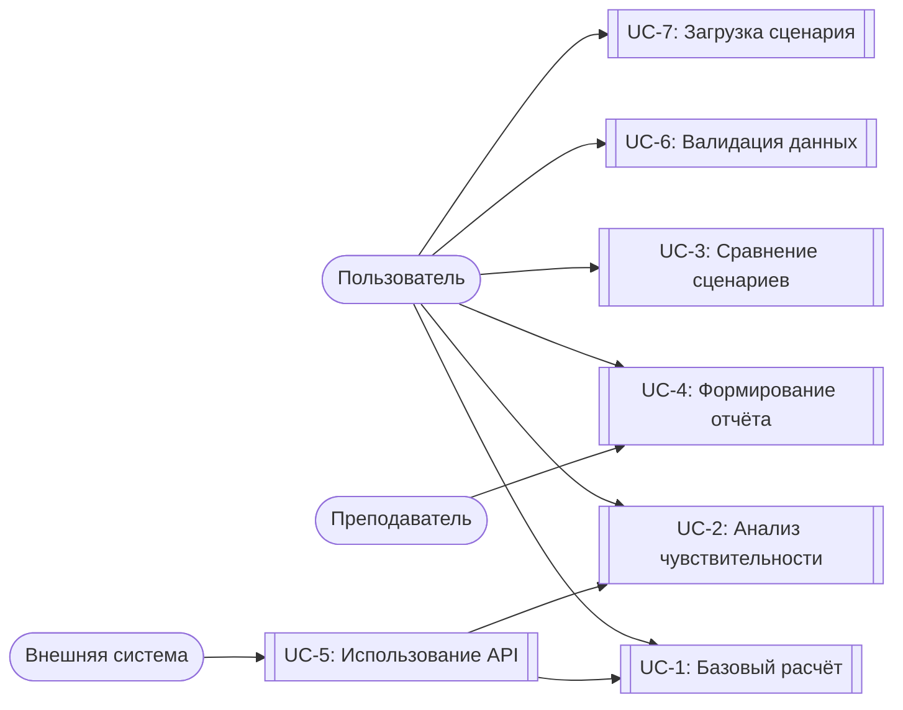
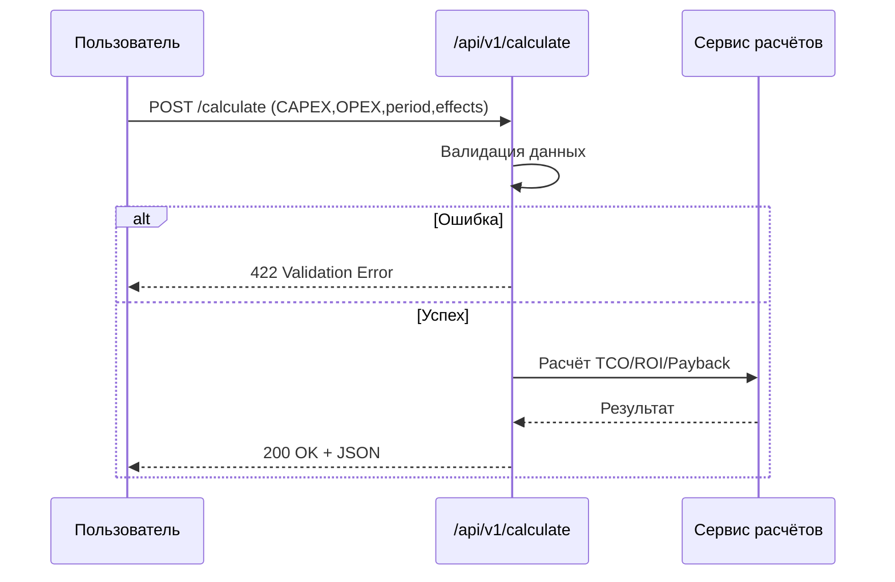
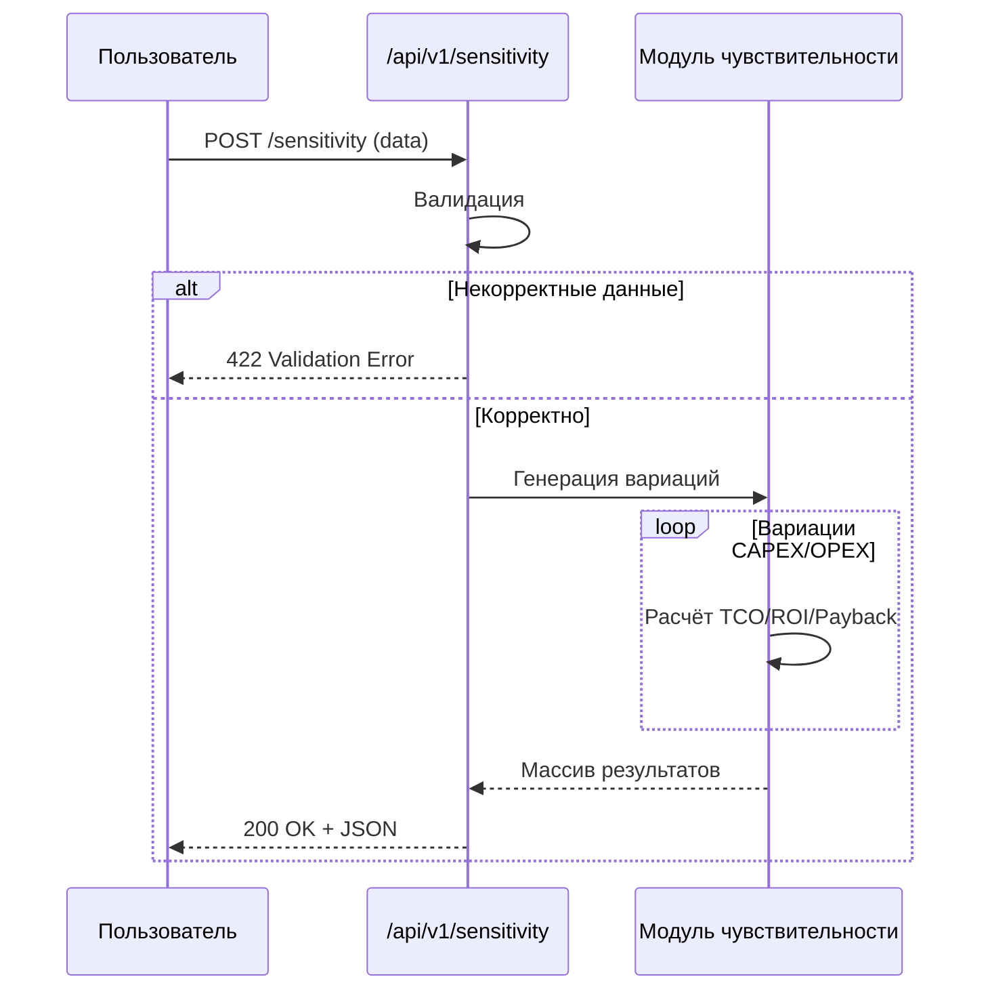
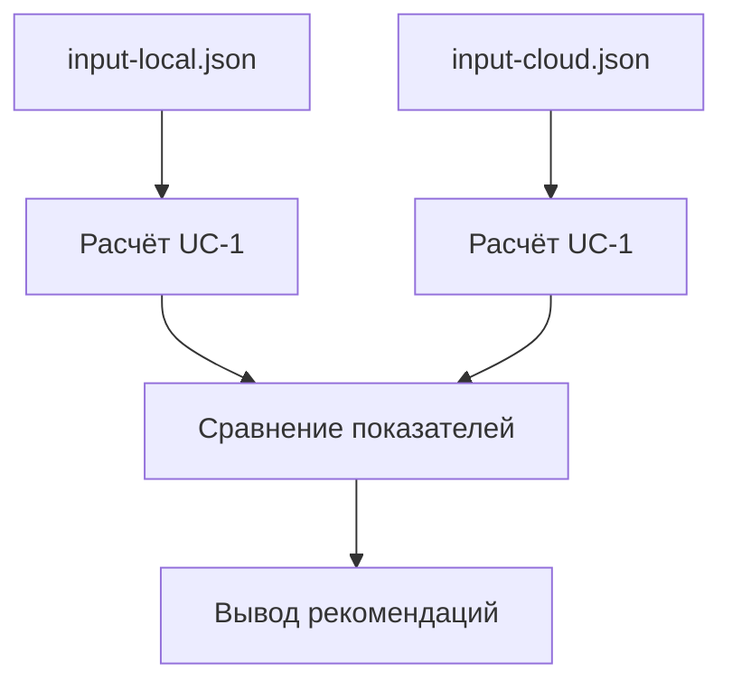
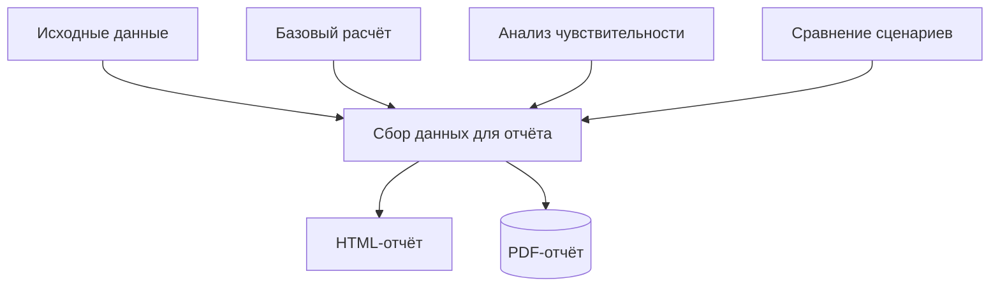
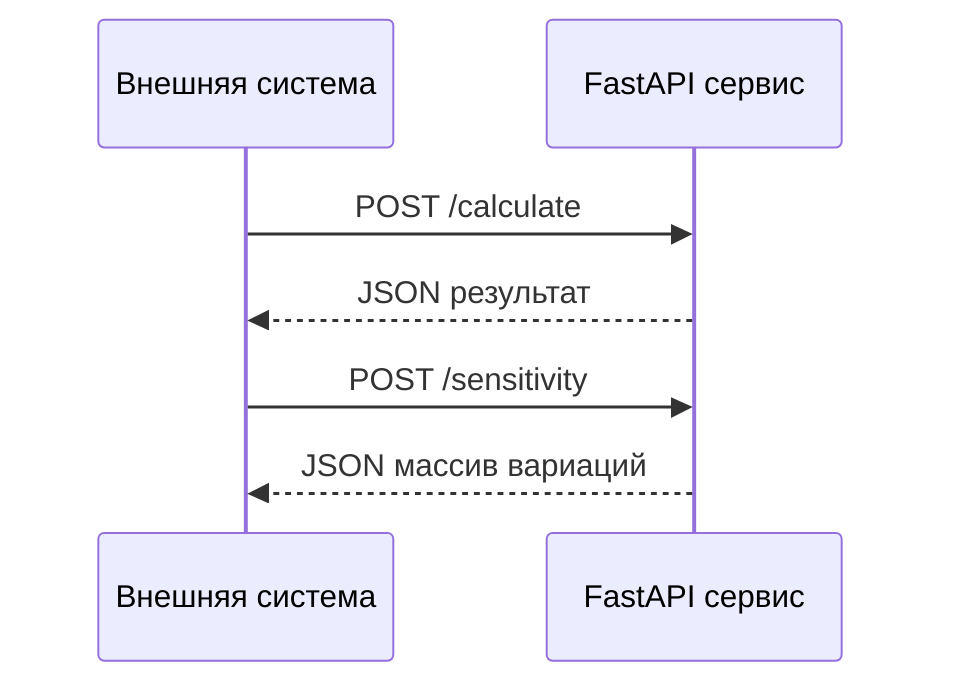
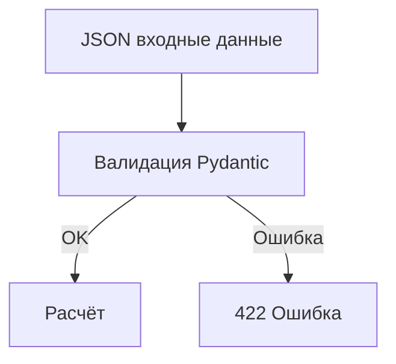
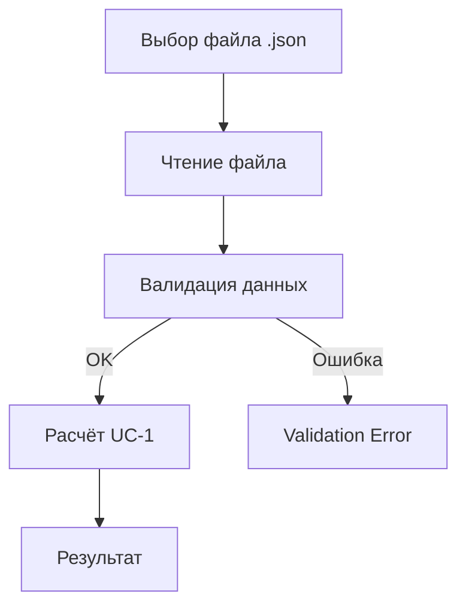

## Use Case модель системы «InvestCalc — Инвестиционный аналитик ИС»

Документ описывает пользовательские сценарии в формате Use Case, включая акторов, пред- и постусловия, основной поток событий, альтернативные потоки и исключения.

Все ключевые диаграммы представлены в формате Mermaid.

---

## 1. Акторы

| Актор | Описание |
|-------|----------|
| **Пользователь** (Студент / Аналитик) | Выполняет ввод данных, запускает расчёты, анализирует результаты |
| **Преподаватель / Руководитель** | Проверяет результат, анализирует отчёты |
| **Внешняя система** | Обращается к API InvestCalc |
| **CI/CD Pipeline** | Запускает тесты и сборку (косвенный актор) |

---

## 2. Общая Use Case-диаграмма

---

## 3. Список Use Cases

| ID   | Название                          | Описание                            |
| ---- | --------------------------------- | ----------------------------------- |
| UC-1 | Выполнить базовый расчёт          | Расчёт TCO, ROI, Payback            |
| UC-2 | Выполнить анализ чувствительности | Вариации CAPEX/OPEX ±20%            |
| UC-3 | Сравнить два сценария             | Локальный vs облачный               |
| UC-4 | Сформировать отчёт                | HTML/PDF                            |
| UC-5 | Использовать API                  | Работа внешних приложений           |
| UC-6 | Проверить корректность данных     | Валидация входа                     |
| UC-7 | Загрузить сценарий из файла       | input-local.json / input-cloud.json |

---

## 4. Use Case UC-1 — Выполнить базовый расчёт

## Диаграмма последовательности

---

## 5. Use Case UC-2 — Выполнить анализ чувствительности

## Диаграмма последовательности

---

## 6. Use Case UC-3 — Сравнить два сценария

## Диаграмма потоков данных

---

## 7. Use Case UC-4 — Сформировать отчёт

## Диаграмма

---

## 8. Use Case UC-5 — Использовать API

## Диаграмма

---

## 9. Use Case UC-6 — Проверка корректности данных

## Диаграмма валидации

---

## 10. Use Case UC-7 — Загрузка сценария

## Диаграмма

