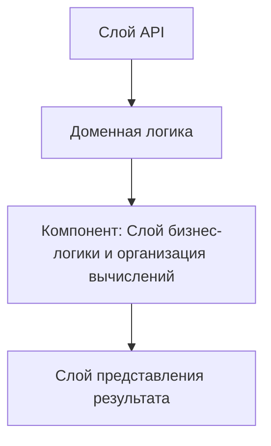

# ADR-05: Слой бизнес-логики и организация вычислений

## 1. Контекст и постановка задачи

Данный ADR фиксирует архитектурное решение по теме «Слой бизнес-логики и организация вычислений» в рамках учебного проекта InvestCalc. Система предназначена для расчёта экономической эффективности информационных систем (TCO, ROI, срок окупаемости, анализ чувствительности) и используется в образовательном процессе СПО. В решении описываются исходные предпосылки, ограничения, альтернативы и последствия выбора.

## 2. Движущие факторы решения

- Соответствие архитектурным принципам проекта InvestCalc
- Понятность решения для студентов и преподавателей
- Соответствие стандартам (ГОСТ 34, ISO/IEC 42010, ISO/IEC 25010)
- Возможность автоматизации (CI/CD, тестирование, мониторинг)
- Поддерживаемость и расширяемость решения в будущем

## 3. Рассматриваемые варианты

## Вариант A — прямой и минималистичный подход

Вариант A предполагает прямолинейный подход без чёткого разделения ответственности и без дополнительного уровня абстракции. Он может быть проще для начальной реализации, но хуже масштабируется по мере роста проекта и усложняет обучение хорошим практикам.

## Вариант B — сбалансированная архитектура, ориентированная на обучение

Вариант B предлагает баланс между формальной архитектурой и практической реализуемостью. Он использует минимально необходимый набор слоёв и инструментов, позволяя постепенно усложнять решение по мере взросления проекта и команды.

## Вариант C — максимально формализованный корпоративный подход

Вариант C ориентирован на максимально формальный и сложный корпоративный подход, включающий множество слоёв, сервисов и интеграций. Такой вариант хорошо подходит для больших промышленных систем, но избыточен для учебного прототипа и может мешать пониманию основ.

## 4. Принятое решение

Принято решение использовать вариант B как основной. Он обеспечивает разумный баланс между сложностью, наглядностью и соответствием современным практикам. Решение даёт достаточно структуры, чтобы демонстрировать студентам правильные подходы, но не перегружает их избыточной инфраструктурой. При необходимости архитектура может быть расширена в сторону более формального корпоративного уровня.

## 5. Положительные последствия

Решение облегчает сопровождение и развитие проекта, делает архитектуру более прозрачной и документируемой, повышает воспроизводимость и позволяет повторно использовать наработки в других учебных и практических проектах. Чёткая фиксация решения в виде ADR помогает отслеживать мотивацию и историю изменений, что важно для командной работы.

## 6. Отрицательные последствия

Наличие дополнительной структуры и формальных артефактов увеличивает начальный порог входа для студентов и требует затрат времени на объяснение. Также часть преимуществ может оказаться невостребованной в маленьком прототипе, что создаёт ощущение «избыточности» архитектуры.

## 7. Плюсы и минусы вариантов

## Вариант A

+ Очень простая начальная реализация  
+ Минимум артефактов и инфраструктуры  

− Плохо масштабируется по мере роста проекта  
− Не демонстрирует современных архитектурных практик  

## Вариант B

+ Хороший баланс между формой и содержанием  
+ Подходит для учебных задач и демонстрации практик  
+ Позволяет развивать проект без радикальной переработки архитектуры  

− Требует начальной дисциплины при проектировании  
− Может казаться избыточным для совсем простых примеров  

## Вариант C

+ Максимально приближен к корпоративным решениям  
+ Позволяет моделировать сложные сценарии и интеграции  

− Слишком сложен для начального уровня студентов  
− Требует значительных усилий по поддержке и объяснению  

## 8. Связанные решения

- ADR-04: Выбор технологического стека: Python 3.12 + FastAPI
- ADR-06: Контракты данных и JSON Schema

## 9. Диаграмма (Mermaid)

## 10. Источники и стандарты

- ГОСТ 34.602-2020 — Техническое задание на создание автоматизированной системы
- ГОСТ 19.201-78 — Техническое задание на программу
- ISO/IEC/IEEE 42010 — Описание архитектуры систем и программного обеспечения
- ISO/IEC 25010 — Модель качества программных продуктов
- RFC 7231 — Семантика HTTP/1.1
- RFC 8259 — JSON Data Interchange Format
- OWASP API Security Top 10
