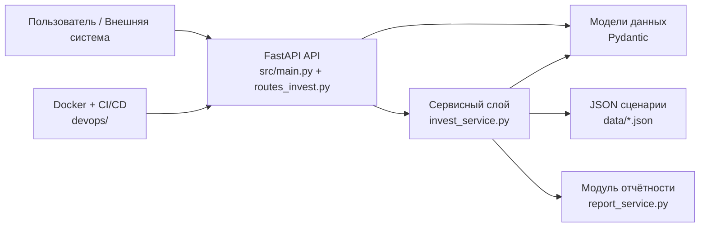

# Архитектурные решения проекта «InvestCalc — Инвестиционный аналитик ИС»

Документ даёт целостный, «человеко-читаемый» обзор архитектуры системы InvestCalc и объясняет, **почему** она устроена именно так.  
Он связывает между собой:

- C4-модель (context / container / component),
- ADR-документы,
- структуру каталогов и кода,
- требования (02-requirements).

---

## 1. Архитектурное видение

### 1.1. Цель системы

InvestCalc — учебная информационная система для:

- расчёта TCO, ROI, Payback;
- анализа чувствительности ±20%;
- сравнения локального и облачного сценария;
- формирования отчётных данных (HTML-отчёт);
- демонстрации студентам полного инженерного цикла: от требований и архитектуры до Docker и CI/CD.

### 1.2. Ключевые принципы архитектуры

1. **Простота для обучения**  
   Архитектура должна быть понятна студентам СПО, не перегружена технологиями.

2. **Чистое разделение слоёв**  
   Отделение API, бизнес-логики, моделей, данных, DevOps.

3. **Stateless-сервис**  
   Отсутствие серверного состояния: каждый запрос самодостаточен.

4. **Self-contained проект**  
   Всё, что нужно студенческой команде (код, документация, шаблоны, Docker, CI/CD) — внутри одного репозитория.

5. **Расширяемость**  
   Возможность развить проект в сторону БД, UI, микросервисов (см. ADR-14).

---

## 2. Связь архитектуры с C4-моделью

Архитектура описана на трёх уровнях C4:

- **Context (c4-context.md)** — место InvestCalc в окружении пользователей и внешних систем.
- **Container (c4-container.md)** — контейнеры: FastAPI API, сервисный слой, JSON-хранилище данных, DevOps-контейнер.
- **Component (c4-component.md)** — компоненты внутри `src/`: `main.py`, `api/v1/routes_invest.py`, `services/invest_service.py`, `models/invest.py`, модуль отчётности и т.д.

### 2.1. Context-уровень

Главные акторы:

- Пользователь / Заказчик (человек),
- Внешняя система (может вызывать API),
- InvestCalc API-сервис.

InvestCalc выступает как **аналитический сервис** в цепочке принятия решений по внедрению ИС.

---

### 2.2. Container-уровень

Основные контейнеры:

- **FastAPI API**  
  Файл `src/main.py` + роутер `src/api/v1/routes_invest.py`.  
  Отвечает за HTTP-интерфейс и автодокументацию.

- **Сервисный слой (Business Logic)**  
  Файл `src/services/invest_service.py`.  
  Вся финансовая математика и логика анализов.

- **Модели данных (Pydantic)**  
  Файл `src/models/invest.py`.  
  Описывает входные/выходные структуры.

- **JSON-хранилище сценариев**  
  Директория `data/` с файлами `input-local.json`, `input-cloud.json`, `samples/`.

- **Модуль отчётности (запланирован)**  
  `src/services/report_service.py` + `templates/report_template.html`.

- **DevOps-контейнер**  
  `devops/Dockerfile`, `devops/docker-compose.yml`, `.github/workflows/build.yml`.

Главное архитектурное решение: **один лёгкий сервис в одном контейнере**.

---

### 2.3. Component-уровень

Компоненты соответствуют структуре `src/`:

- `src/main.py` — точка входа, создание FastAPI-приложения, регистрация роутеров.
- `src/api/v1/routes_invest.py` — HTTP-маршруты:
  - `/calculate`,
  - `/sensitivity`,
  - `/compare`,
  - `/report`.
- `src/models/invest.py` — Pydantic-модели:
  - вход: `InvestmentInput`, `SensitivityInput`, др.;
  - выход: `CalcResult`, `SensitivityResult`, др.
- `src/services/invest_service.py` — центральная бизнес-логика:
  - `calculate_tco`,
  - `calculate_roi`,
  - `calculate_payback`,
  - `calculate_all`,
  - `sensitivity_analysis`,
  - `compare_scenarios`.
- `src/core/config.py` — конфигурация, настройки, переменные окружения.

---

## 3. Ключевые архитектурные решения (в связке с ADR)

### 3.1. Технологический стек (ADR-01)

**Решение:** Python 3.12 + FastAPI + Pydantic + Uvicorn + pytest + Docker + GitHub Actions.

**Почему так:**

- минимальный порог входа,
- современный стек,
- встроенная автодокументация API,
- удобная валидация через Pydantic,
- хорошая поддержка Docker и CI/CD.

---

### 3.2. Стратегия развёртывания (ADR-02)

**Решение:** основной способ запуска — через Docker и `docker-compose`.

**Аргументы:**

- одинаковое окружение для всех студентов,
- повторяемость развёртывания,
- удобство для учебных стендов и серверов,
- возможность масштабирования (ADR-12).

---

### 3.3. Структура каталогов (ADR-03)

**Решение:** чёткое разделение:

```text
src/      — код
tests/    — автотесты
docs/     — документация
data/     — сценарные JSON-данные
templates/— шаблоны отчётов и документов
devops/   — Docker, CI/CD, инструкции
project/  — skeleton-проекты (api/client/db)
```

**Зачем:**

* студентам проще ориентироваться,
* структура совпадает с архитектурными блоками,
* каждый слой выделен физически.

---

### 3.4. Pydantic-модели и валидация (ADR-04)

**Решение:** все входные и выходные структуры описываются через Pydantic, с явными ограничениями (`ge=0`, `period>=1` и т.п.).

**Цели:**

* жёсткая валидация входных данных,
* автоматическое описание моделей в Swagger,
* упрощение тестирования и отладки,
* безопасность (ADR-11).

---

### 3.5. Выделение сервисного слоя (ADR-05)

**Решение:** бизнес-логика (формулы и правила) вынесена в `services/invest_service.py`, отдельно от роутеров.

**Причины:**

* очистка API-кода,
* возможность модульного тестирования без API,
* переиспользование логики в отчётности и будущем UI,
* сходство с Clean Architecture.

---

### 3.6. Stateless-архитектура (ADR-06)

**Решение:** сервис не хранит состояние между запросами, не использует сессии или БД в базовой версии.

**Плюсы:**

* легче масштабировать,
* проще деплоить,
* меньше рисков утечек,
* прямое следование REST-принципам.

---

### 3.7. Модуль отчётности (ADR-07)

**Решение:** отчёты — отдельный модуль, использующий результаты расчётов.

**Причины:**

* отчёт — ключевой образовательный артефакт,
* удобство для преподавателей,
* возможность гибкой визуализации данных (HTML/PDF).

---

### 3.8. Формат сценариев (ADR-08)

**Решение:** сценарии хранятся в JSON, без базы данных.

**Зачем:**

* проще студентам,
* легко версионировать в Git,
* совместимо с REST,
* не требует инфраструктуры БД.

---

### 3.9. CI/CD через GitHub Actions (ADR-09)

**Решение:** автоматические проверки (pytest + Docker build) при push / PR.

**Эффекты:**

* контроль качества кода,
* единый pipeline для команды,
* соответствие реальной инженерной практике.

---

### 3.10. Стратегия тестирования (ADR-10)

**Решение:** pytest + структура тестов по слоям:

* `test_api.py`
* `test_service.py`
* `test_sensitivity.py`

**Цель:** покрыть все ключевые бизнес-правила и сценарии использования.

---

### 3.11. Безопасность API (ADR-11)

**Решение:** базовый уровень безопасности:

* строгая валидация;
* минимальная поверхность API (несколько эндпоинтов);
* безопасная обработка ошибок;
* отсутствие хранения чувствительных данных.

---

### 3.12. Масштабирование (ADR-12)

**Решение:** горизонтальное масштабирование через несколько контейнеров / несколько воркеров Uvicorn.

---

### 3.13. Логирование и мониторинг (ADR-13)

**Решение:** базовый logging + middleware для логирования запросов + Docker-логи + healthchecks.

---

### 3.14. Путь расширения (ADR-14)

**Решение:** зафиксированный roadmap развития:

* добавление БД;
* UI на React/Next.js;
* микросервисы;
* расширенный DevOps.

---

## 4. Как архитектура связана с требованиями

### 4.1. Связь с функциональными требованиями

* UC-1…UC-4 (расчёты, чувствительность, сравнение, отчёт) **реализуются** в сервисном слое и API.
* Каждое FR из `functional.md` опирается на конкретный компонент:

  * API-роут → сервис → модели → данные.

### 4.2. Связь с нефункциональными требованиями

* Производительность и надёжность — через лёгкий FastAPI-сервис и stateless-дизайн.
* Сопровождаемость — через структурированную архитектуру, ADR и тесты.
* Безопасность — через Pydantic, обработку ошибок, отсутствие хранения чувствительных данных.

---

## 5. Архитектурный «скелет» проекта (Mermaid)



---

## 6. Архитектурные компромиссы

Некоторые решения приняты как **компромисс** между учебной простотой и «боевой» архитектурой:

* отсутствие БД → проще в обучении, но не хранится история;
* отсутствие аутентификации → меньше кода, но нет multi-user;
* один сервис вместо микросервисов → легче понять, сложнее масштабировать по доменам (но не по числу инстансов).

Все эти компромиссы **осознанно зафиксированы** и описаны в ADR- и requirements-документах.

---
