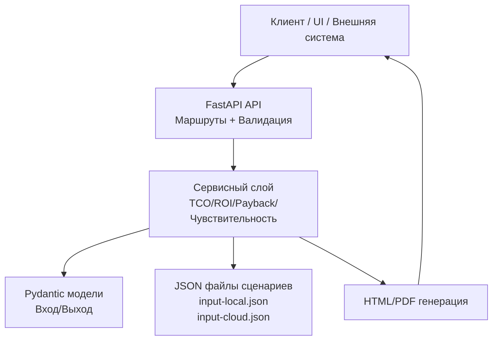
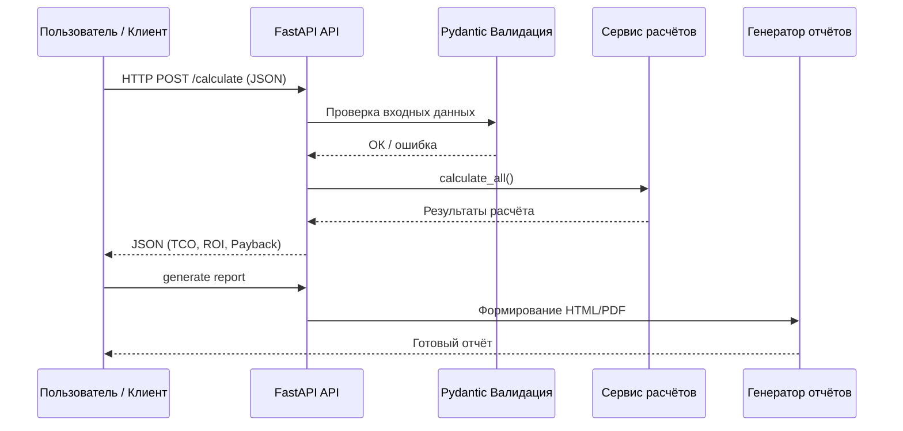

# Архитектурный обзор системы InvestCalc

Документ содержит расширённое описание архитектуры учебной информационной системы «InvestCalc — Инвестиционный аналитик ИС».  
Он объясняет ключевые архитектурные решения, организацию слоёв, принципы построения системы, интеграционные возможности и направления развития.

---

## 1. Архитектурный стиль

InvestCalc реализован как:
- **легковесный REST API-сервис**,  
- построенный по **трёхслойной архитектуре**:

```

API → Service Layer → Models

```

Система полностью **stateless**, не хранит историю запросов и легко контейнеризуется.

---

## 2. Архитектурные принципы

1. **Простота и минимализм** — архитектура должна быть понятна студентам.
2. **Разделение ответственности (SoC)**:
   - API-слой: маршрутизация и валидация.
   - Сервисный слой: бизнес-логика расчётов.
   - Модели: данные и структуры.
3. **Тестируемость** — каждый слой тестируется отдельно.
4. **Расширяемость** — можно добавить:
   - БД,
   - модуль отчётности,
   - UI,
   - экспорт в PDF,
   - фронтенд.
5. **Stateless-архитектура** — отсутствие зависимости от состояния между запросами.
6. **Интегрируемость** — внешний доступ через REST.

---

## 3. Обзор архитектуры (Mermaid–диаграмма уровня Overview)



---

## 4. Слои системы

### 4.1. API-слой (FastAPI)

Файлы:

* `src/main.py`
* `src/api/v1/routes_invest.py`

Отвечает за:

* маршрутизацию HTTP-запросов,
* преобразование входных данных,
* валидацию Pydantic,
* генерацию автоматической OpenAPI-документации,
* возврат JSON-ответов.

Преимущества:

* изоляция бизнес-логики от веб-фреймворка,
* легкая заменяемость UI/клиента.

---

### 4.2. Сервисный слой (Business Logic)

Файл:

* `src/services/invest_service.py`

Отвечает за расчёты:

* TCO,
* ROI,
* Payback Period,
* анализ чувствительности (±20%),
* сравнение сценариев.

Особенности:

* не зависит от API,
* легко тестируется,
* может быть вынесен в отдельный микросервис.

---

### 4.3. Модели данных (Schemas)

Файл:

* `src/models/invest.py`

Содержит:

* входные модели (InputData),
* модели ответа (CalcResult),
* модели чувствительности.

Используется библиотека **Pydantic**.

Гарантии:

* корректность входных данных,
* автоматическая сериализация/десериализация,
* строгая типизация.

---

## 5. Логический поток данных (Mermaid)



---

## 6. Используемые технологии

| Компонент          | Технология      |
| ------------------ | --------------- |
| Основной фреймворк | FastAPI         |
| Сервер             | Uvicorn         |
| Модели             | Pydantic        |
| Документация API   | Swagger / Redoc |
| Тестирование       | pytest          |
| Контейнеризация    | Docker          |
| CI/CD              | GitHub Actions  |
| Документация       | MkDocs          |

---

## 7. Развёртывание

InvestCalc поддерживает:

* локальный запуск (`uvicorn src.main:app --reload`);
* запуск через Docker;
* запуск через docker-compose;
* автоматическую сборку через GitHub Actions.

Сервис полностью портативный.

---

## 8. Потенциальные расширения архитектуры

1. **База данных**

   * PostgreSQL
   * Sqlite (в учебных целях)

2. **Хранение сценариев**

   * отдельная таблица scenarios

3. **Генерация PDF-отчётов**

   * WeasyPrint
   * ReportLab

4. **UI-клиент**

   * React/Vue SPA, Next.js

5. **Горизонтальное масштабирование**

   * Gunicorn + Uvicorn workers
   * Nginx как reverse proxy

6. **Микросервисная архитектура**
   Возможное выделение сервисов:

   * документации,
   * отчётов,
   * расчётов.

---

## 9. Связь архитектуры с документацией

Полная архитектура описана в:

* `c4-context.md`
* `c4-container.md`
* `c4-component.md`
* ADR-файлах

Этот документ служит обзором, а C4 — детализацией.

 
 