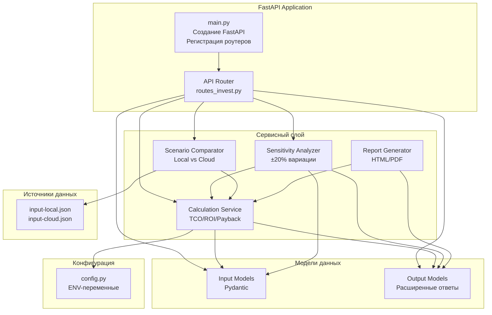
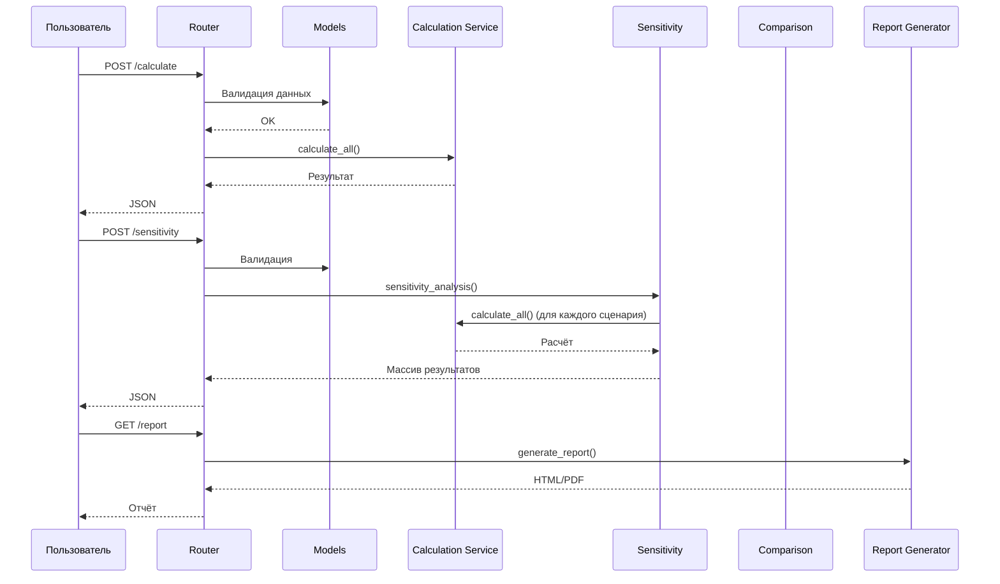

# C4 Model — Уровень 3: Component Diagram 

Диаграмма уровня компонентов показывает внутреннее устройство контейнера InvestCalc API:  
модули, сервисы, модели, точки входа, вспомогательные компоненты и связи между ними.

---

## 1. Назначение уровня Component

На этом уровне описываем:
- из каких модулей состоит система,
- как они взаимодействуют,
- какие функции выполняют,
- как организована бизнес-логика,
- где находятся точки расширения.

Уровень Component соответствует структуре каталога **`src/`**.

---

## 2. Основные компоненты системы

| Компонент | Директория | Ответственность |
|----------|------------|----------------|
| **API Router** | `src/api/v1/routes_invest.py` | Обработка HTTP запросов, маршруты, OpenAPI |
| **FastAPI App** | `src/main.py` | Инициализация сервиса, middleware, конфигурация |
| **Input/Output Models** | `src/models/invest.py` | Pydantic модели данных |
| **Calculation Service** | `src/services/invest_service.py` | TCO/ROI/Payback, чувствительность, сравнение |
| **Config Component** | `src/core/config.py` | Настройки, переменные окружения |
| **Report Component** (опционально) | `src/services/report_service.py` | Генерация HTML/PDF отчётов |
| **Scenario Loader** | `data/*.json` | Чтение и загрузка сценариев |
| **Tests** | `tests/` | Автотесты модулей и API |

---

## 3. C4 Component Diagram (Mermaid)

---

## 4. Подробное описание компонентов

### 4.1. FastAPI Application (`main.py`)

Функции:

* создание объекта FastAPI,
* подключение роутеров,
* настройка CORS (опционально),
* настройка Swagger,
* настройка middleware.

Главная точка входа при запуске.

---

### 4.2. API Router (`routes_invest.py`)

Содержит эндпоинты:

* `POST /api/v1/calculate`
* `POST /api/v1/sensitivity`
* `GET /api/v1/report`
* `GET /api/v1/scenario/{name}`

Отвечает за:

* приём входных данных,
* проверку через модели,
* передачу в сервисный слой.

---

### 4.3. Модели данных (`models/invest.py`)

Использует Pydantic.

#### Входные модели:

* InputData
* SensitivityInput
* ScenarioInput

#### Выходные модели:

* CalcResult
* SensitivityResult
* ScenarioComparisonResult

Гарантирует корректность данных и предсказуемость API.

---

### 4.4. Calculation Service (`invest_service.py`)

Ключевой компонент.

#### Отвечает за:

* `calculate_tco()`
* `calculate_roi()`
* `calculate_payback()`
* `calculate_all()`
* `sensitivity_analysis()`
* `compare_scenarios()`

Ядро бизнес-логики.

---

### 4.5. SENS — Sensitivity Analyzer

Реализует метод:

* анализ влияния ±20% на CAPEX/OPEX,
* генерацию набора сценариев,
* обработку ошибок.

---

### 4.6. COMP — Scenario Comparator

Используется в:

* учебных заданиях,
* демонстрации различий между моделями внедрения.

Сравнивает:

* локальный сценарий,
* облачный сценарий.

---

### 4.7. Report Generator (опционально)

Планируемый компонент:

* HTML-отчёты,
* PDF-экспорт,
* встроенные шаблоны.

---

## 5. Внутренние взаимодействия (Sequence, Mermaid)

---

## 6. Принципы компонентной архитектуры

### 6.1. Независимость

Каждый компонент можно:

* заменить,
* протестировать,
* масштабировать,
* развивать отдельно.

### 6.2. Чистая бизнес-логика

Сервисный слой не зависит от FastAPI.
Это позволяет:

* выполнять расчёты без API,
* запускать модульные тесты без поднятого сервера,
* переносить сервис в микросервис.

### 6.3. Валидация как отдельный слой

Pydantic защищает API от:

* неправильных типов,
* отрицательных значений,
* отсутствующих параметров.

### 6.4. Ясность структуры

Структура `src/` соответствует C4-component уровню.
Каждый файл = отдельный компонент.
 