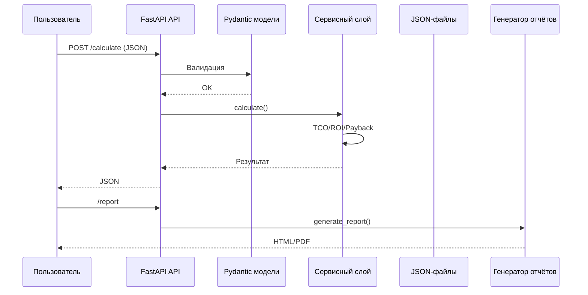

# C4 Model — Уровень 2: Container Diagram 

Диаграмма уровня контейнеров показывает внутреннюю структуру системы — основные компоненты, их ответственность и взаимодействие.

---

## 1. Назначение уровня Container

На этом уровне важно определить:
- архитектурные контейнеры системы (API, сервисы, модели, DevOps-инфраструктура),
- границы между ними,
- связи и интерфейсы,
- направление данных.

Контейнеры соответствуют реальной структуре директории `src/`, `devops/`, `docs/`.

---

## 2. Контейнеры системы

| Контейнер | Технология | Ответственность |
|-----------|------------|----------------|
| **API-сервис (FastAPI)** | FastAPI + Uvicorn | Приём HTTP-запросов, валидация, маршрутизация, OpenAPI |
| **Сервисный слой (Business Logic)** | Python | Расчёты TCO/ROI/Payback, чувствительность, сравнение сценариев |
| **Модели данных (Pydantic)** | Pydantic | Входные/выходные модели, типизация и валидация |
| **Генератор отчётов** | Python/Jinja2 | HTML-отчёты, PDF (опционально) |
| **JSON-хранилище сценариев** | Файлы | Input-local.json, input-cloud.json, примеры |
| **DevOps-контейнер** | Docker | Сборка, запуск, деплой через Dockerfile |
| **CI/CD Pipeline** | GitHub Actions | Автоматизация тестов, сборки и проверки кода |

---

## 3. C4 Container Diagram (Mermaid)

```mermaid
flowchart TB

    subgraph clientside["Клиентская сторона"]
        USER[Пользователь / UI]
        EXT[Внешняя система (CRM/Портал)]
    end

    subgraph api["API-контейнер"]
        API[FastAPI<br/>HTTP REST API]
    end

    subgraph logic["Бизнес-логика"]
        SERVICE[Сервисный слой<br/>Рассчёты TCO/ROI/Payback]
        MODELS[Pydantic-модели<br/>Вход/Выход]
    end

    subgraph reporting["Модуль отчётности"]
        REPORT[Генератор отчётов<br/>HTML/PDF]
    end

    subgraph datafiles["Файлы сценариев"]
        FILES[JSON файлы<br/>input-local.json<br/>input-cloud.json]
    end

    subgraph devops["DevOps контейнер"]
        DOCKER[Dockerfile<br/>docker-compose<br/>healthcheck]
    end

    subgraph cicd["CI/CD Pipeline"]
        GH[GitHub Actions]
    end

    USER -->|HTTP JSON| API
    EXT -->|API вызовы| API

    API --> SERVICE
    API --> MODELS

    SERVICE --> MODELS
    SERVICE --> FILES
    SERVICE --> REPORT

    GH --> API
    GH --> DOCKER

    DOCKER --> API
```

---

## 4. Описание контейнеров

### 4.1. API-контейнер (FastAPI)

Источник: `src/main.py`, `src/api/v1/routes_invest.py`

Отвечает за:

* внешнее взаимодействие через REST,
* OpenAPI документацию,
* проверку входных данных,
* возврат результатов.

Преимущества:

* высокое быстродействие,
* удобный Swagger UI.

---

### 4.2. Контейнер бизнес-логики

Источник: `src/services/invest_service.py`

Содержит:

* формулы,
* расчёты,
* анализ чувствительности,
* логику сравнения сценариев.

Особенности:

* полностью изолирован,
* тестируется отдельно.

---

### 4.3. Контейнер моделей

Источник: `src/models/invest.py`

Роль:

* строгая типизация входных данных,
* валидация CAPEX, OPEX, периода, эффекта.

---

### 4.4. Контейнер отчётности

Выделен в упрощённый модуль:

Роль:

* генерация HTML-отчёта,
* генерация PDF (опционально),
* шаблоны в будущем → `templates/report.html`.

---

### 4.5. Контейнер JSON-файлов (Data Container)

Файлы находятся в:

```
/data/input-local.json
/data/input-cloud.json
/data/samples/*.json
```

Используется для:

* сравнения сценариев,
* тестирования,
* демонстрации API.

---

### 4.6. DevOps-контейнер

Находится в:

```
/devops/Dockerfile
/devops/docker-compose.yml
/devops/healthchecks.md
```

Обеспечивает:

* упаковку сервиса,
* запуск через Uvicorn,
* healthcheck,
* логи.

---

### 4.7. CI/CD контейнер (Pipeline)

Реализован в:

```
/devops/.github/workflows/build.yml
```

Выполняет:

* установку зависимостей,
* запуск тестов,
* сборку контейнера,
* проверки (linting, mypy — опционально).

---

## 5. Поток данных между контейнерами (Sequence, Mermaid)



---

## 6. Границы контейнеров

### Внутри InvestCalc

* API
* сервисы
* модели
* отчёты
* файлы сценариев

### Снаружи

* UI / внешние клиенты
* внешние системы
* CI/CD пайплайн
 