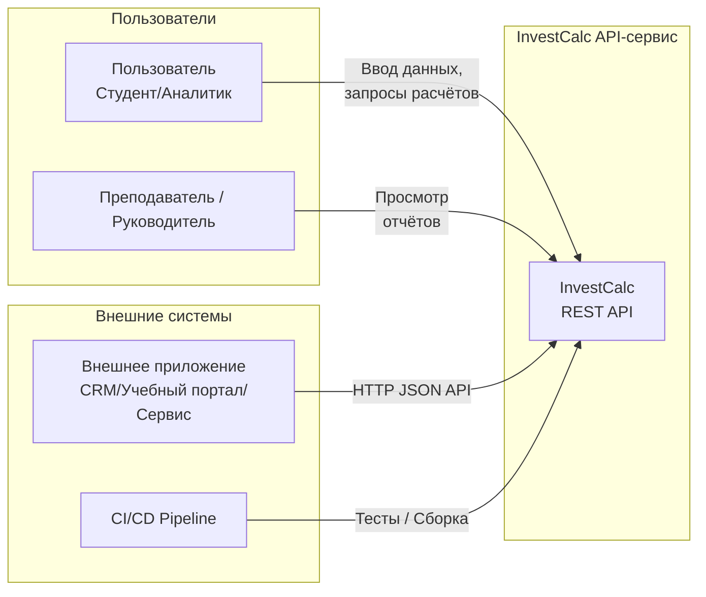

# C4 Model — Уровень 1: Context Diagram
 

Контекстная диаграмма описывает систему на уровне взаимодействия с внешними пользователями и системами.  
Это самый верхний уровень архитектуры, служащий для понимания роли InvestCalc в общем окружении.

---

## 1. Назначение диаграммы

- Показать InvestCalc как единую систему.
- Определить внешних акторов.
- Определить внешние системы и источники данных.
- Обозначить основные взаимодействия в высокоуровневой форме.

---

## 2. Основные акторы

| Актор | Тип | Описание |
|-------|------|-----------|
| **Пользователь (Студент/Аналитик)** | Человек | Вводит данные, запускает расчёты, формирует отчёты |
| **Преподаватель/Руководитель** | Человек | Анализирует отчёты и проверяет корректность |
| **Внешняя система / Клиентское приложение** | Система | Выполняет запросы к API InvestCalc |
| **CI/CD Pipeline** | Система | Тестирует и собирает сервис (косвенный актор) |

---

## 3. Контекстная диаграмма (Mermaid, C4-стиль)

> Для лучшей совместимости используется Mermaid с блоками `flowchart`, адаптированный под формат C4.



---

## 4. Описание взаимодействий

### 4.1. Пользователь → InvestCalc

Пользователь выполняет:

* ввод CAPEX/OPEX,
* запуск расчётов TCO/ROI/Payback,
* анализ чувствительности,
* запрос отчёта.

### 4.2. Преподаватель → InvestCalc

Использует систему для:

* проверки результатов,
* анализа расчётов студентов,
* просмотра отчётов.

### 4.3. Внешняя система → InvestCalc

Любой сервис (CRM/портал/учебная система) может:

* выполнять API-вызовы,
* получать JSON с расчётами,
* встраивать InvestCalc как «аналитический модуль».

### 4.4. CI/CD Pipeline → InvestCalc

GitHub Actions выполняет:

* тесты,
* сборку Docker,
* проверку кода,
* развёртывание.

---

## 5. Окружение системы

```
+-----------------------------------------------------------------+
|                           Внешний мир                           |
|                                                                 |
|  +-------------------------+            +----------------------+ |
|  |   Пользователь          |            | Преподаватель        | |
|  +-----------+-------------+            +----------+-----------+ |
|              |                                 |               |
|              v                                 v               |
|        +-----+---------------------------------+-----+         |
|        |         InvestCalc REST API-сервис          |         |
|        |   FastAPI • JSON • Swagger • Containerized  |         |
|        +-------------------+-------------------------+         |
|                            |                                   |
|                            v                                   |
|               +------------+-------------+                     |
|               | Внешние приложения (API) |                     |
|               +--------------------------+                     |
|                                                                 |
+-----------------------------------------------------------------+
```

---

## 6. Границы системы

### **Внутри InvestCalc**

* API
* расчёты TCO/ROI/Payback
* анализ чувствительности
* генерация отчётов
* валидация данных

### **Снаружи**

* источники данных (файлы JSON)
* внешние сервисы
* пользователи
* CI/CD

 
