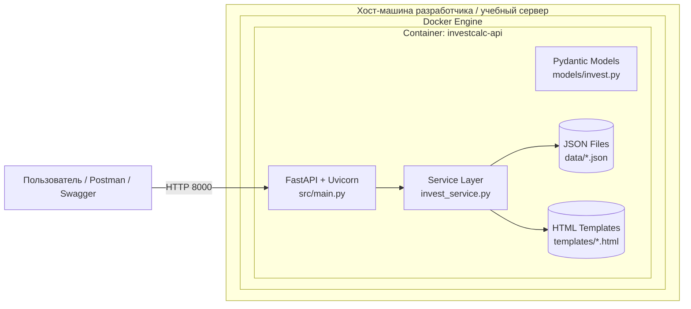
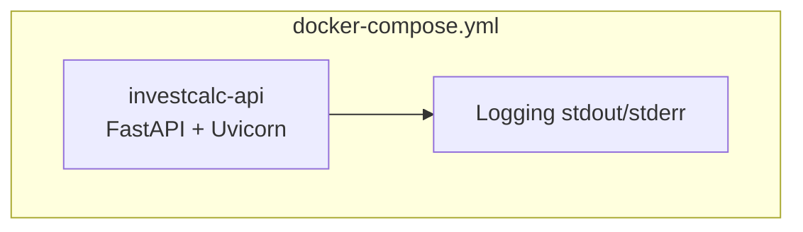
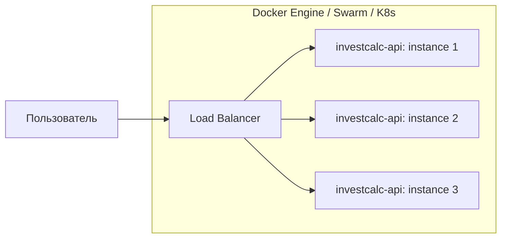
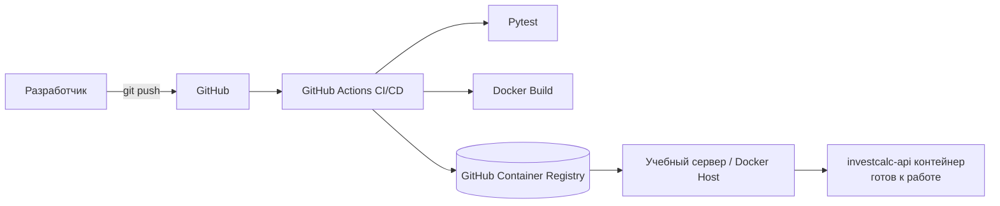

# Deployment Diagram — Диаграмма развертывания InvestCalc

Документ описывает, как система InvestCalc разворачивается в рабочей среде, включая:

- инфраструктуру запуска (локальная машина, Docker),
- компоненты FastAPI и сервисного слоя,
- размещение JSON-данных,
- DevOps-пайплайн,
- вариант расширенного развертывания (масштабирование).

---

## 1. Цель документа

Диаграмма развертывания показывает **где и как физически выполняется InvestCalc**, какие используемые контейнеры, параметры окружения, точки входа, внешний доступ и связи между компонентами.

Документ основан на:

- ADR-02 «Deployment Strategy»  
- ADR-06 «Stateless Architecture»  
- ADR-12 «Scalability»  
- C4 Container Diagram  

---

## 2. Базовая архитектура развертывания

Система разворачивается в **одном Docker-контейнере**, содержащем:

- FastAPI-приложение,
- сервисный слой,
- Pydantic-модели,
- хранилище JSON-сценариев (внутри контейнера или volume),
- Uvicorn сервер.

Запуск осуществляется через:

```

docker-compose up --build

```

---

## 3. Deployment Diagram (Mermaid)

### 3.1. Локальное развертывание (основной сценарий)



---

### 3.2. Развертывание с Docker Compose



---

### 3.3. Масштабирование (вариант ADR-12)



**Почему это возможно?**
Сервис stateless → каждый экземпляр может обрабатывать запросы независимо.

---

## 4. Элементы развертывания

### 4.1. Хост-машина

Используются:

* Docker Engine
* Docker Compose
* Python 3.12 (только для локальных запусков без Docker)
* GitHub Actions runner (он выполняет CI)

OS может быть:

* Windows 10/11 (WSL optional)
* Linux Ubuntu
* macOS

---

### 4.2. Docker-контейнер

Dockerfile:

* базовый образ: `python:3.12-slim`,
* установка зависимостей `requirements.txt`,
* копирование проекта,
* запуск:

```
uvicorn src.main:app --host 0.0.0.0 --port 8000
```

Контейнер:

* НЕ содержит состояния,
* НЕ требует БД,
* использует JSON-файлы, упакованные в образ или volume.

---

### 4.3. Docker Compose

Минимальная конфигурация:

```yaml
services:
  investcalc:
    build: .
    ports:
      - "8000:8000"
    volumes:
      - ./data:/app/data
```

Опциональная конфигурация:

* healthchecks,
* replicas,
* environment variables.

---

## 5. CI/CD Deployment Flow (расширенная схема)

### Поток:

1. Коммит в main/develop.
2. GitHub Actions запускает:

   * линтер (опционально),
   * pytest,
   * сборку Docker-образа.
3. На успех:

   * можно публиковать образ в GitHub Container Registry,
   * можно автоматически разворачивать на сервере колледжа (опция).

### Диаграмма (Mermaid)



---

## 6. Используемые протоколы и порты

| Компонент | Порт | Протокол    | Описание                |
| --------- | ---- | ----------- | ----------------------- |
| FastAPI   | 8000 | HTTP/1.1    | Основной API            |
| Docker    | N/A  | Unix socket | Управление контейнерами |

HTTPS не используется в учебной версии.

---

## 7. Требования к развёртыванию

* Docker Engine ≥ 20.x
* Docker Compose ≥ v2
* 512 MB RAM (достаточно)
* Python ≥ 3.12 (опционально)
* Права на чтение каталога data/
 