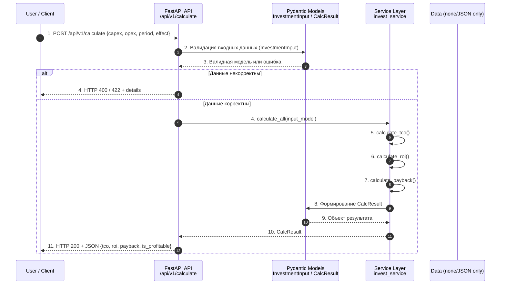
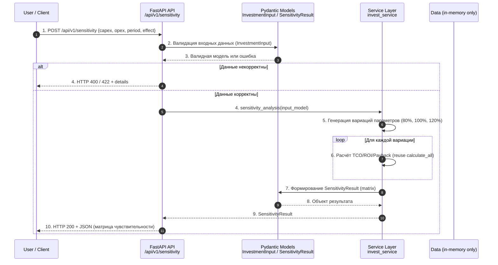
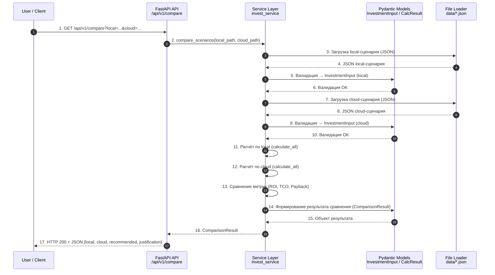
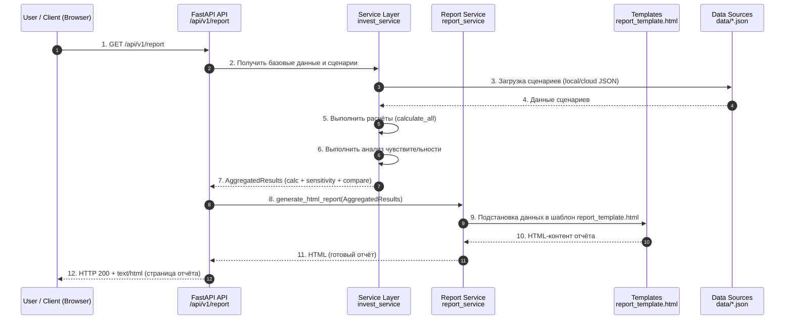

# Sequence Diagrams — Диаграммы последовательностей InvestCalc

Документ содержит UML-диаграммы последовательностей (в формате Mermaid) для основных сценариев использования системы InvestCalc:

- UC-1 — Базовый расчёт (Calculate)
- UC-2 — Анализ чувствительности (Sensitivity)
- UC-3 — Сравнение сценариев (Compare)
- UC-4 — Формирование отчёта (Report)

Диаграммы показывают, **как взаимодействуют** пользователь, API, сервисный слой, модели и данные.

---

## 1. UC-1 — Выполнить базовый расчёт (Calculate)

**Описание:**  
Пользователь (или внешняя система) отправляет входные данные (CAPEX, OPEX, Period, Effect), а система возвращает рассчитанные TCO, ROI, Payback и флаг `is_profitable`.

### 1.1. Диаграмма последовательностей (Mermaid)

---

## 2. UC-2 — Анализ чувствительности (Sensitivity Analysis)

**Описание:**
Пользователь задаёт базовые входные данные, система автоматически варьирует параметры (по умолчанию CAPEX/OPEX ±20%) и возвращает матрицу результатов.

### 2.1. Диаграмма последовательностей (Mermaid)

---

## 3. UC-3 — Сравнение сценариев (Compare Scenarios)

**Описание:**
Система сравнивает два сценария (обычно локальный и облачный), выполняет расчёты по каждому и возвращает сравнительный результат с рекомендацией.

### 3.1. Диаграмма последовательностей (Mermaid)

---

## 4. UC-4 — Формирование отчёта (Generate Report)

**Описание:**
Система формирует HTML-отчёт (и в перспективе PDF) на основе результатов расчётов, анализа чувствительности и сравнения сценариев.

### 4.1. Диаграмма последовательностей (Mermaid)

---

## 5. Использование диаграмм при разработке и защите проекта

Диаграммы последовательностей:

* демонстрируют понимание **взаимодействия компонентов**;
* помогают студентам реализовать и отлаживать код;
* служат связующим звеном между:

  * Use Case-описанием (`use-cases.md`),
  * архитектурой (`c4-*.md`, ADR),
  * реализацией (слои `api/`, `services/`, `models/`).

На защите проекта:

* можно использовать этот документ для пояснения логики работы системы;
* легко показать, как запрос «проходит» через все уровни.

