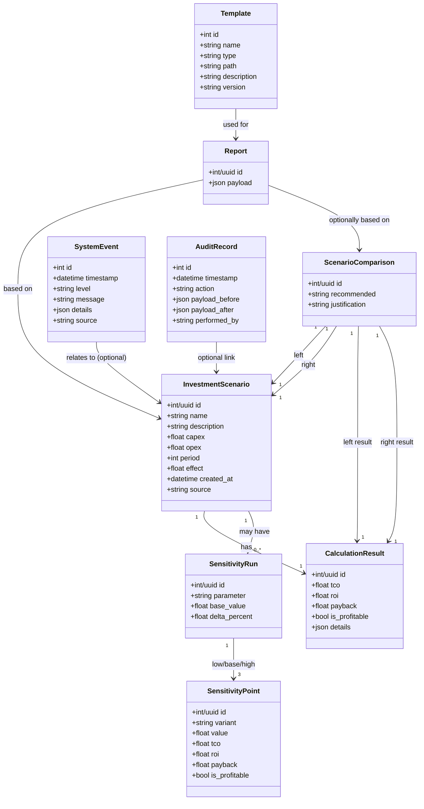

# Domain Model — Предметная модель InvestCalc

Документ описывает **предметную область** и основные сущности, с которыми работает система InvestCalc, на уровне объектной (domain) модели.  
Модель не привязана жёстко к конкретной СУБД и может быть реализована:

- в виде Pydantic-моделей;
- в виде ORM-моделей (SQLAlchemy) при добавлении БД;
- в виде DTO для API.

---

## 1. Цели предметной модели

Предметная модель отвечает за:

- формализацию понятий предметной области;
- описание сущностей и их связей;
- подготовку к разработке БД (логическая модель → ER-диаграмма);
- выравнивание понимания между разработчиками и заказчиком/преподавателем.

---

## 2. Основные сущности предметной области

### 2.1. InvestmentScenario — Инвестиционный сценарий

**Смысл:**  
Описывает один конкретный сценарий внедрения ИС (например, локальная инфраструктура или облачный SaaS).

**Поля (минимальный набор):**

- `id` — идентификатор сценария (UUID/INT).
- `name` — название сценария (например, «On-premises», «Cloud/SaaS»).
- `description` — краткое описание.
- `capex` — капитальные затраты.
- `opex` — ежегодные операционные затраты.
- `period` — период анализа (лет).
- `effect` — годовой экономический эффект.
- `created_at` — дата создания (для БД-версии).
- `source` — источник: `json`, `manual`, `api`.

---

### 2.2. CalculationResult — Результат расчёта

**Смысл:**  
Отдельный объект, отражающий результат применения формул к одному сценарию.

**Поля:**

- `scenario_id` — ссылка на сценарий (опционально, при наличии БД).
- `tco` — Total Cost of Ownership.
- `roi` — рентабельность инвестиций (%).
- `payback` — срок окупаемости (лет, может быть `null`).
- `is_profitable` — флаг окупаемости.
- `details` — дополнительные поля (опционально).

---

### 2.3. SensitivityRun — Запуск анализа чувствительности

**Смысл:**  
Описывает один запуск анализа чувствительности для конкретного базового сценария.

**Поля:**

- `id`
- `scenario_id`
- `parameter` — по какому параметру считаем чувствительность (`capex`, `opex`, `effect`).
- `base_value` — базовое значение параметра.
- `delta_percent` — % изменения (по умолчанию 20).

---

### 2.4. SensitivityPoint — Точка чувствительности

**Смысл:**  
Конкретный вариант параметра (low/base/high) и его результат.

**Поля:**

- `run_id` — ссылка на `SensitivityRun`.
- `variant` — `low` | `base` | `high`.
- `value` — значение параметра (например, capex=0.8×base).
- `tco`, `roi`, `payback`, `is_profitable`.

---

### 2.5. ScenarioComparison — Сравнение сценариев

**Смысл:**  
Объект, который хранит сравнение двух сценариев и итоговую рекомендацию.

**Поля:**

- `id`
- `left_scenario_id`
- `right_scenario_id`
- `left_result_id`
- `right_result_id`
- `recommended` — `left` | `right` | `equal`.
- `justification` — текстовое обоснование.

---

### 2.6. Report — Отчёт (логическая сущность)

**Смысл:**  
Объект, содержащий агрегированные данные для формирования отчёта.

**Поля:**

- `id`
- `scenario_id` или `comparison_id`
- `payload` — JSON/структура, включающая:
  - исходные данные;
  - результаты расчётов;
  - чувствительность;
  - сравнение сценариев;
  - текст выводов.

В базовой версии отчёты не сохраняются, но модель нужна для описания структуры HTML-страницы и потенциальной БД.

---

## 3. Дополнительные сущности (расширенная предметная модель)

Эти сущности **не обязательны в минимальной версии**, но нужны для:

- соответствия DevOps-документации,
- улучшения отслеживаемости,
- расширения системы до полноправной ИС,
- согласованности с логированием и шаблонами документов.

---

### 3.1. SystemEvent — Событие системы (лог)

**Смысл:**  
Представляет собой внутреннее событие, записываемое системой во время работы.  
Используется для логирования и мониторинга.

**Поля:**

- `id` — идентификатор события;
- `timestamp` — время фиксации события;
- `level` — уровень (`INFO`, `WARNING`, `ERROR`, `CRITICAL`);
- `message` — текст события;
- `details` — доп. контекст в JSON (например, входные данные);
- `source` — модуль или компонент (`api`, `service`, `docker`, `scheduler`).

**Зачем нужно:**

- согласованность с `logging.md`,
- поддержка system events в DevOps,
- возможность хранить логи в БД (если она появится).

---

### 3.2. AuditRecord — Аудиторская запись

**Смысл:**  
Фиксирует бизнес-действия пользователя или системы (для отслеживаемости и соответствия требованиям ПИДИС).

**Поля:**

- `id`
- `timestamp`
- `action` — тип действия (`calculate`, `sensitivity`, `compare`, `report`)
- `payload_before`
- `payload_after`
- `performed_by` — идентификатор пользователя (если система расширена до ролевой модели)

**Зачем нужно:**

- демонстрация принципов аудитирования,
- связь с security-документацией,
- позволяет делать учебную аналитику по действиям.

---

### 3.3. Template — Шаблон документа

**Смысл:**  
Описывает доступный шаблон отчёта или документа, размещённый в папке `templates/`.

**Поля:**

- `id`
- `name`
- `type` — `docx`, `md`, `html`
- `path` — путь в файловой системе
- `description`
- `version`

**Зачем нужно:**

- соответствие структуре проекта (`templates/`);
- возможность выбора шаблона при генерации отчёта;
- полнота предметной модели по ГОСТ 34 (раздел «Документирование системы»).

---

## 4. Диаграмма предметной области (Mermaid classDiagram)

---

## 5. Связь предметной модели с кодом

Pydantic-модели (models/invest.py) реализуют логическую часть InvestmentInput / CalcResult.

При переходе к БД:

* InvestmentScenario → таблица `scenarios`
* CalculationResult → `calc_results`
* SensitivityRun → `sensitivity_runs`
* SensitivityPoint → `sensitivity_points`
* ScenarioComparison → `comparisons`
* Report → `reports`
* SystemEvent → `system_events`
* AuditRecord → `audit_records`
* Template → `templates`

