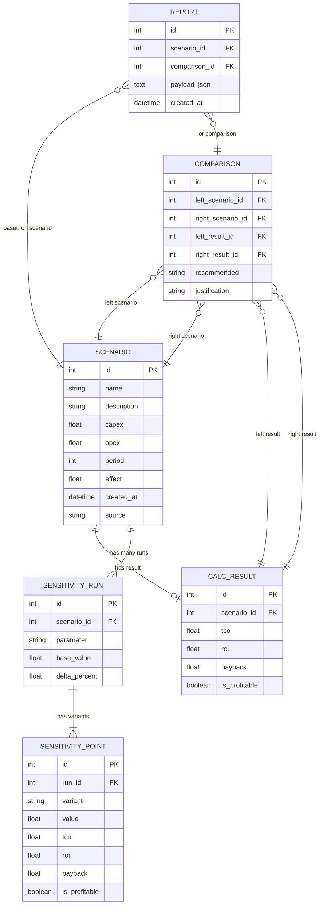

# ER Diagram — ER-диаграмма данных InvestCalc

Документ описывает **логическую модель данных** в виде ER-диаграммы.  
Она отражает потенциальную структуру БД (для расширенной версии проекта) и основывается на предметной модели (`domain-model.md`).

---

## 1. Сущности и связи (обзор)

Основные сущности:

- `SCENARIO` — сценарий инвестиций;
- `CALC_RESULT` — результат расчёта по сценарию;
- `SENSITIVITY_RUN` — запуск анализа чувствительности;
- `SENSITIVITY_POINT` — точка чувствительности;
- `COMPARISON` — сравнение двух сценариев;
- `REPORT` — (опционально) сохранённый отчёт.

Связи:

- один `SCENARIO` → один `CALC_RESULT`;
- один `SCENARIO` → множество `SENSITIVITY_RUN`;
- один `SENSITIVITY_RUN` → три `SENSITIVITY_POINT` (low/base/high);
- один `COMPARISON` → два `SCENARIO` и два `CALC_RESULT`;
- `REPORT` может ссылаться либо на `SCENARIO`, либо на `COMPARISON`.

---

## 2. ER-диаграмма (Mermaid erDiagram)

---

## 3. Нормализация и ключи

### 3.1. Нормальные формы

* Данные структурированы минимум в **3НФ**:

  * каждый факт хранится один раз;
  * нет повторяющихся групп полей;
  * нет транзитивных зависимостей вне ключей.

### 3.2. Первичные и внешние ключи

* Все `id` — первичные ключи (PK).
* `scenario_id`, `run_id`, `left_scenario_id` и т.п. — внешние ключи (FK).
* При физической реализации в SQL для FK задаются ограничения `FOREIGN KEY`.

---

## 4. Связь ER-модели с JSON-файлами

В базовой (учебной) версии:

* JSON-файлы `data/input-local.json`, `data/input-cloud.json` реализуют **упрощённый поднабор сущности SCENARIO** без `id` и метаданных;
* остальные сущности («результат», «чувствительность», «сравнение») существуют только в оперативной модели и не сохраняются в БД.

При переходе к БД:

* JSON можно рассматривать как «источник» для заполнения таблиц;
* структура таблиц повторяет поля JSON, расширяя их техническими полями (`id`, `created_at`, `source`).

---

