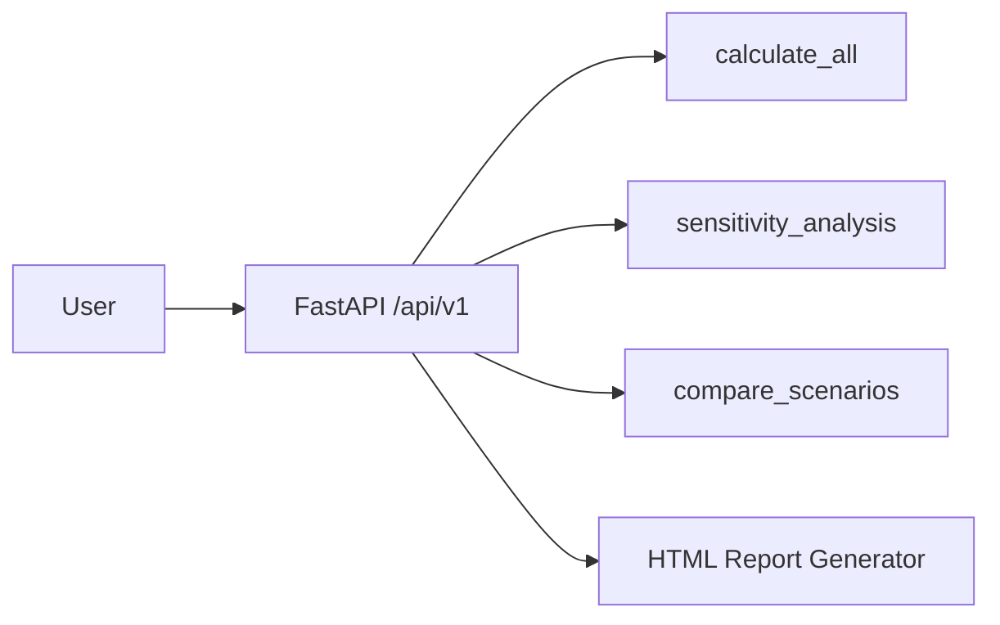

# API Overview — Обзор API InvestCalc

API InvestCalc реализовано на основе FastAPI и представляет собой REST-сервис для выполнения экономических расчётов, анализа чувствительности, сравнения сценариев и генерации отчётов.

---

## 1. Назначение API

API позволяет:

- выполнять расчёт TCO/ROI/Payback;
- строить анализ чувствительности (±20% для CAPEX/OPEX);
- сравнивать два сценария (например, local vs cloud);
- генерировать HTML-отчёт;
- использовать систему внешними приложениями (интеграции).

API используется:

- студентами — для выполнения проекта;
- преподавателями — для проверки работы;
- фронтендом (если будет внедрён UI);
- внешними системами.

---

## 2. Технологический стек

- **FastAPI 0.110+**
- **Uvicorn** — приложение ASGI
- **Pydantic v2** — модели данных
- **JSON** — формат обмена данными

Документация доступна по адресам:

```

/docs     — Swagger UI
/redoc    — ReDoc
/openapi.json

```

---

## 3. Структура API

Основная версия: **v1**

Все эндпоинты расположены в пространстве:

```

/api/v1/

```

---

## 4. Список эндпоинтов

| Эндпоинт | Метод | Назначение |
|----------|--------|------------|
| `/calculate` | POST | Базовый расчёт экономических показателей |
| `/sensitivity` | POST | Анализ чувствительности |
| `/compare` | GET | Сравнение двух сценариев |
| `/report` | GET | HTML-отчёт по расчётам |
| `/health` | GET | Проверка работоспособности |

---

## 5. Common JSON Model

Все расчёты принимают модель:

```json
{
  "capex": 100000,
  "opex": 20000,
  "period": 5,
  "effect": 40000
}
```

---

## 6. Диаграмма взаимодействия API (Mermaid)



---

## 7. Ошибки API

Формат ошибок:

```json
{
  "error": "Invalid input",
  "details": [
    {
      "loc": ["capex"],
      "msg": "Value must be >= 0"
    }
  ]
}
```

Коды:

| Код | Значение                  |
| --- | ------------------------- |
| 200 | Успешный запрос           |
| 400 | Ошибка данных             |
| 422 | Ошибка валидации Pydantic |
| 500 | Ошибка сервера            |

---
