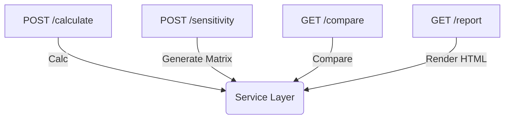

# API Endpoints — Описание эндпоинтов InvestCalc

В этом документе подробно описаны все эндпоинты, входные и выходные данные, примеры запросов и ответов.

---

## 1. POST /api/v1/calculate — базовый расчёт

### 1.1. Назначение
Выполняет расчёт основных метрик:

- TCO
- ROI
- Payback
- is_profitable

### 1.2. Входные данные

```json
{
  "capex": 100000,
  "opex": 20000,
  "period": 5,
  "effect": 40000
}
```

### 1.3. Пример запроса

```bash
curl -X POST http://localhost:8000/api/v1/calculate \
  -H "Content-Type: application/json" \
  -d '{"capex":100000,"opex":20000,"period":5,"effect":40000}'
```

### 1.4. Пример ответа

```json
{
  "capex": 100000,
  "opex": 20000,
  "period": 5,
  "effect": 40000,
  "tco": 200000,
  "roi": 100,
  "payback": 2.5,
  "is_profitable": true
}
```

---

## 2. POST /api/v1/sensitivity — анализ чувствительности

### 2.1. Назначение

Строит матрицу ±20% для CAPEX/OPEX.

### 2.2. Пример запроса

```bash
curl -X POST http://localhost:8000/api/v1/sensitivity \
  -H "Content-Type: application/json" \
  -d '{"capex":500000,"opex":60000,"period":4,"effect":120000}'
```

### 2.3. Пример ответа

```json
{
  "parameter": "capex",
  "values": [
    { "variant": "low",  "capex": 400000, "tco": 640000, "roi": 150, "payback": 1.78 },
    { "variant": "base", "capex": 500000, "tco": 740000, "roi": 100, "payback": 2.1 },
    { "variant": "high", "capex": 600000, "tco": 840000, "roi": 50,  "payback": 2.4 }
  ]
}
```

---

## 3. GET /api/v1/compare — сравнение сценариев

### 3.1. Параметры запроса

```
/api/v1/compare?local=input-local.json&cloud=input-cloud.json
```

### 3.2. Пример ответа

```json
{
  "local": { "roi": 120, "tco": 450000, "payback": 2.1 },
  "cloud": { "roi": 85,  "tco": 380000, "payback": 2.7 },
  "recommended": "local",
  "justification": "Local scenario provides higher ROI"
}
```

---

## 4. GET /api/v1/report — HTML отчёт

### Пример

```
http://localhost:8000/api/v1/report
```

Ответ:

* `Content-Type: text/html`
* HTML-страница с:

  * исходными данными,
  * расчётами,
  * чувствительностью,
  * сравнением,
  * выводами.

---

## 5. GET /api/v1/health — проверка состояния

Ответ:

```json
{
  "status": "ok"
}
```

---

## 6. Диаграмма полного API (Mermaid)



 
