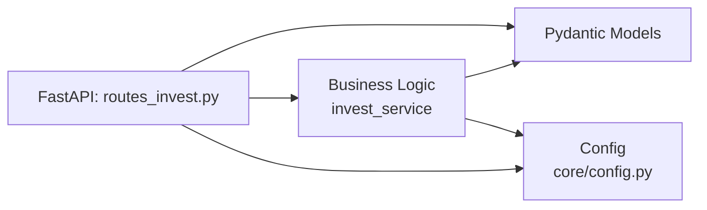

# Code Structure — Структура исходного кода InvestCalc

Документ описывает структуру папки `src/`, назначение каталогов и файлов, принципы реализации, связи между компонентами и правила написания кода.

---

## 1. Архитектурные принципы реализации

Исходный код InvestCalc построен на основе следующих принципов:

1. **Чистое разделение слоёв**  
   - API  
   - бизнес-логика (services)  
   - модели (models)  
   - конфигурация (core)

2. **Stateless-дизайн**  
   Приложение не хранит состояние между запросами.

3. **Простая и прозрачная структура**  
   Облегчает обучение, ревью и тестирование.

4. **Минимум зависимостей**  
   FastAPI + Pydantic + встроенные библиотеки.

---

## 2. Общая структура

```

src/
│
├── main.py
├── api/
│   ├── **init**.py
│   └── v1/
│       ├── **init**.py
│       └── routes_invest.py
│
├── models/
│   ├── **init**.py
│   └── invest.py
│
├── services/
│   ├── **init**.py
│   └── invest_service.py
│
└── core/
├── **init**.py
└── config.py

```

---

## 3. Назначение каталогов

### 3.1. `src/main.py`
Точка входа FastAPI-приложения:

- создание приложения;
- подключение роутеров (`routes_invest`);
- подключение middleware;
- настройка обработки ошибок;
- root-эндпоинты (`/health`).

---

### 3.2. `src/api/v1/routes_invest.py`
Реализация HTTP-эндпоинтов:

- `POST /calculate`
- `POST /sensitivity`
- `GET  /compare`
- `GET  /report`
- `GET  /health`

Каждый эндпоинт:
- принимает Pydantic-модель,
- вызывает сервисный слой,
- возвращает JSON или HTML.

---

### 3.3. `src/models/invest.py`
Pydantic-модели:

- `InvestmentInput`
- `CalcResult`
- `SensitivityResult`
- `ComparisonResult`
- модели для отчёта

Задачи:

- строгая типизация;
- валидация данных;
- OpenAPI-схемы для Swagger.

---

### 3.4. `src/services/invest_service.py`
Центральная бизнес-логика системы:

- `calculate_tco()`
- `calculate_roi()`
- `calculate_payback()`
- `calculate_all()`
- `sensitivity_analysis()`
- `compare_scenarios()`

Особенности:

- никакой логики в API;
- отсутствие вызовов файловой системы в бизнес-логике (только загрузка сценариев в отдельной функции);
- 100% покрытие тестами.

---

### 3.5. `src/core/config.py`
Конфигурация приложения:

- параметры FastAPI;
- название проекта;
- настройки HTML-отчётов;
- параметры CORS (если будут нужны);
- version / api_prefix.

---

## 4. Диаграмма взаимодействия слоёв (Mermaid)



---

## 5. Принципы написания кода

* API не содержит логики — только маршрутизацию.
* Все расчёты выполняются в сервисах.
* Все данные проходят Pydantic-валидацию.
* Возврат — только JSON или HTML (никаких raw-строк).
* Все функции должны иметь docstring.
* Логирование ошибок обязательно (см. `security.md`).
* Каждый новый компонент требует ADR-решения, если меняет архитектуру.

