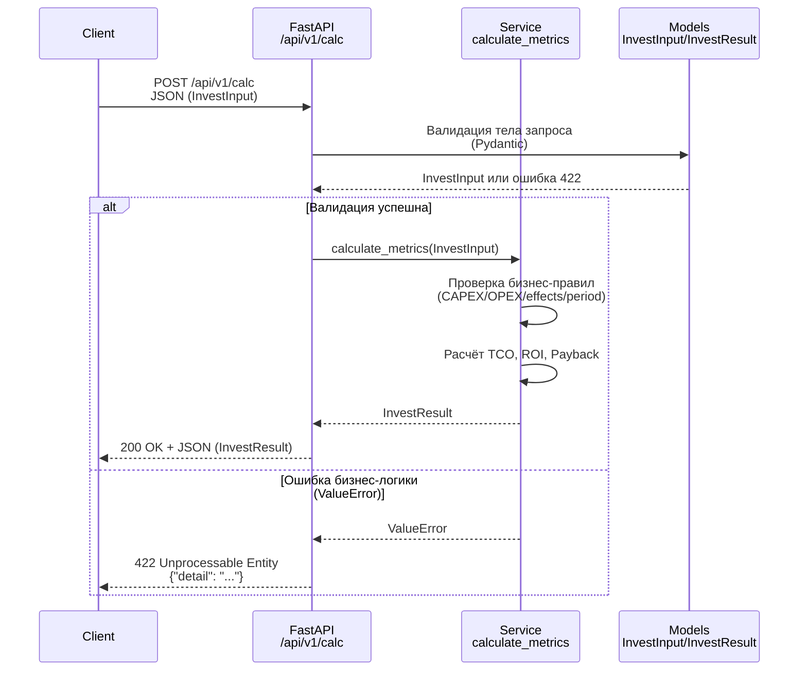
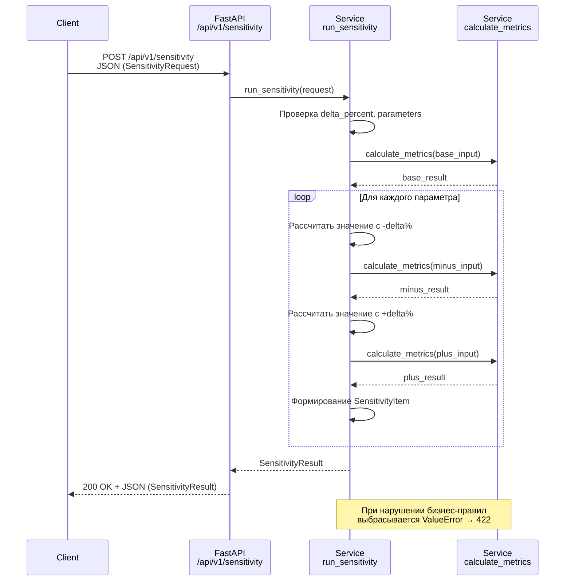
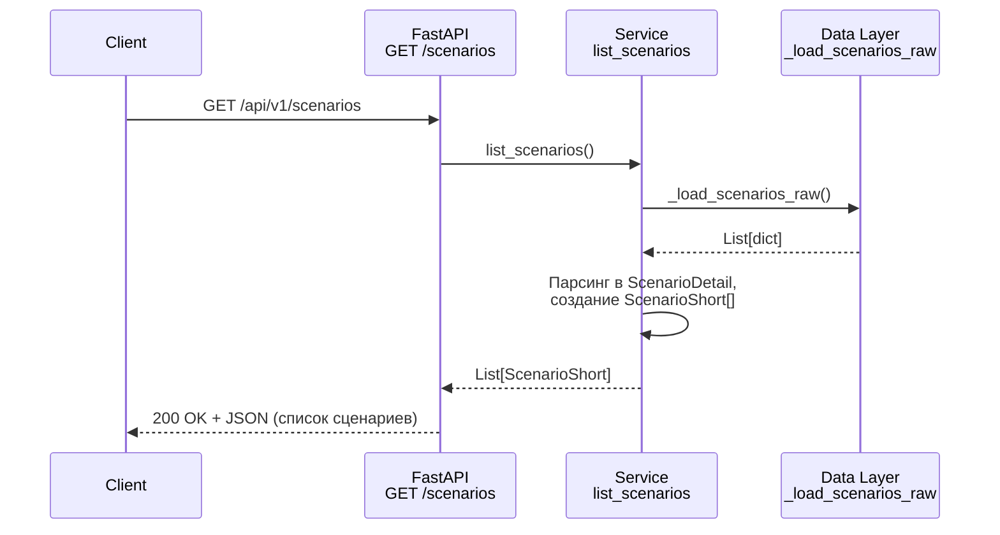
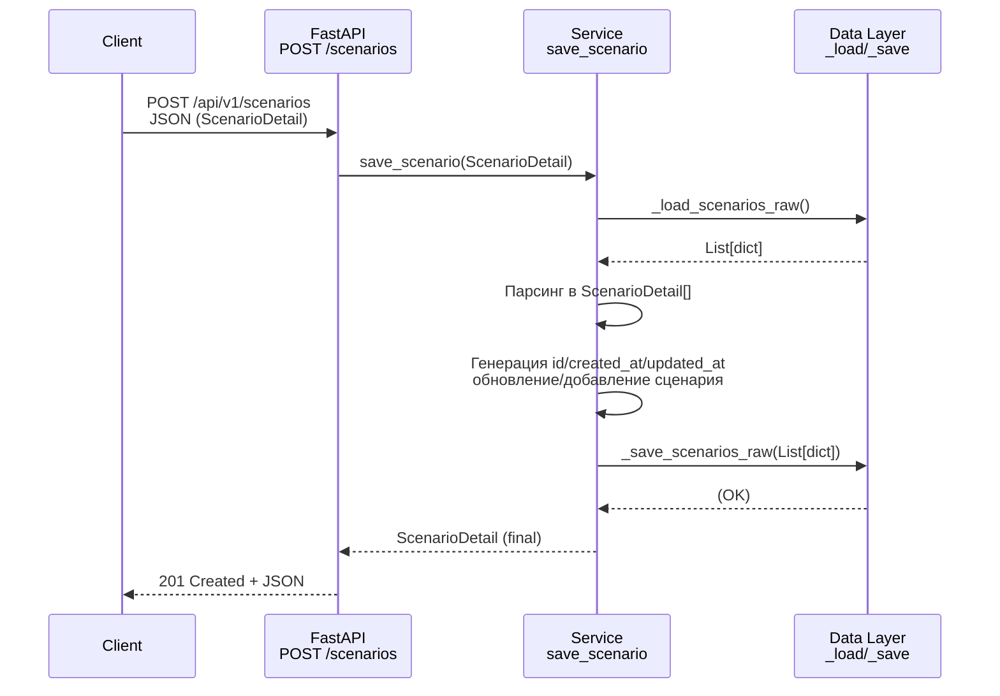

# Поток обработки запросов (Internal API Flow)

Проект: **InvestCalc — Инвестиционный аналитик ИС**  
Версия документа: 1.0  
Дата: `<указать>`

---

## 1. Назначение документа

Документ описывает **сквозной путь запроса** через систему InvestCalc:

- от клиента (Swagger / внешний потребитель API),
- через FastAPI-слой,
- в бизнес-логику и подсистему доступа к данным (JSON),
- и обратно к клиенту.

Цель — помочь разработчикам и проверяющим быстро понять, *как именно* запрос обрабатывается внутри приложения.

---

## 2. Общий обзор слоёв

Логическая архитектура API разделена на несколько слоёв:

1. **Client / Consumer**  
   - браузер + Swagger UI,  
   - внешний HTTP-клиент (например, frontend, Postman, curl).

2. **FastAPI Layer (Presentation / Transport)**  
   - `src/main.py` — создание приложения и подключение роутеров,  
   - `src/api/v1/routes_invest.py` — эндпоинты `/calc`, `/sensitivity`, `/scenarios`.

3. **Business Logic Layer (Domain / Service)**  
   - `src/services/invest_service.py` — расчёты TCO/ROI/Payback, анализ чувствительности, работа со сценариями.

4. **Data Access Layer (JSON Storage)**  
   - `src/services/invest_service.py` — функции `_load_scenarios_raw`, `_save_scenarios_raw`, `list_scenarios`, `get_scenario`, `save_scenario`.  
   - Физическое хранилище: `data/scenarios.json`.

5. **Configuration & Settings**  
   - `src/core/config.py` — пути до `data/`, `scenarios.json`, метаданные приложения.

---

## 3. Поток запроса: расчёт показателей (`POST /api/v1/calc`)

### 3.1. Текстовое описание

1. Клиент отправляет `POST /api/v1/calc` с JSON-телом, соответствующим модели `InvestInput`.  
2. FastAPI:
   - парсит тело и валидирует его через Pydantic → `InvestInput`;
   - при ошибке валидации возвращает `422`.
3. Контроллер `calculate_invest_metrics` принимает `InvestInput`.
4. Контроллер вызывает `services.invest_service.calculate_metrics(input_data)`.
5. Бизнес-логика:
   - проверяет бизнес-ограничения (CAPEX/OPEX/Effects ≥ 0, период > 0),
   - считает `TCO`, `ROI`, `Payback`.
6. Возвращается объект `InvestResult`.
7. FastAPI сериализует его в JSON согласно `response_model=InvestResult`.
8. Клиент получает структурированный ответ или ошибку.

### 3.2. Диаграмма последовательности (Mermaid)

---

## 4. Поток запроса: анализ чувствительности (`POST /api/v1/sensitivity`)

### 4.1. Текстовое описание

1. Клиент отправляет `POST /api/v1/sensitivity` с телом `SensitivityRequest`.
2. FastAPI валидирует модель `SensitivityRequest`.
3. Контроллер `sensitivity_analysis` вызывает `run_sensitivity(request)`.
4. `run_sensitivity`:

   * проверяет, что `delta_percent > 0` и список `parameters` не пуст,
   * считает **базовый** результат через `calculate_metrics(base_input)`,
   * для каждого параметра (`capex`, `opex`, `effects`):

     * уменьшает его на `delta_percent`,
     * пересчитывает показатели,
     * увеличивает на `delta_percent`,
     * формирует `SensitivityItem`.
5. Возвращается `SensitivityResult` (базовый результат + массив `items`).
6. FastAPI выдаёт JSON-ответ клиенту.

### 4.2. Диаграмма последовательности

---

## 5. Поток запроса: работа со сценариями (`/api/v1/scenarios`)

### 5.1. Получение списка сценариев (`GET /api/v1/scenarios`)

1. Клиент вызывает `GET /api/v1/scenarios`.
2. FastAPI вызывает `list_scenarios()`.
3. Функция:

   * читает `data/scenarios.json` через `_load_scenarios_raw`,
   * парсит каждый элемент в `ScenarioDetail`,
   * конвертирует в `ScenarioShort` для ответа,
   * сортирует по `updated_at` / `created_at`.
4. Возвращается список `ScenarioShort[]`.

---

### 5.2. Получение сценария по ID (`GET /api/v1/scenarios/{id}`)

1. Клиент вызывает `GET /api/v1/scenarios/{scenario_id}`.
2. FastAPI вызывает `get_scenario(scenario_id)`.
3. Функция:

   * читает `scenarios.json`,
   * ищет элемент по полю `"id"`,
   * если найден → парсит в `ScenarioDetail`,
   * если нет → возвращает `None`.
4. HTTP-слой:

   * при `None` → `404 Not Found`,
   * иначе → `200 OK + JSON`.

---

### 5.3. Создание/обновление сценария (`POST /api/v1/scenarios`)

1. Клиент отправляет `POST /api/v1/scenarios` с телом `ScenarioDetail`.
2. FastAPI валидирует `ScenarioDetail`.
3. Контроллер вызывает `save_scenario(scenario)`.
4. Функция:

   * загружает существующие сценарии,
   * приводит их к `ScenarioDetail[]`,
   * генерирует `id`, `created_at`, `updated_at` при необходимости,
   * обновляет или добавляет сценарий,
   * сериализует всё в список dict и записывает в `scenarios.json`.
5. Возвращает финальный `ScenarioDetail` с заполненными полями.
6. HTTP-слой возвращает `201 Created + JSON`.

---

## 6. Жизненный цикл запроса на уровне кода

Условно для любого “нормального” запроса:

1. **Transport**:
   FastAPI принимает HTTP → парсит JSON → создаёт Pydantic-модель.

2. **Validation**:
   Валидация через Pydantic и бизнес-проверки в сервисах.

3. **Application / Domain**:
   Сервисы (`invest_service`) выполняют расчёты/операции.

4. **Data Access** (если нужно):
   Чтение/запись в JSON.

5. **Response Construction**:
   Сервисы возвращают модели, FastAPI сериализует их в JSON.

6. **Error Mapping**:
   Ошибки валидации → 422,
   `ValueError` → 422,
   `None (not found)` → 404,
   `OSError` → 500.

---

## 7. Связанные документы

* `docs/05-api/api-overview.md`
* `docs/05-api/endpoints-invest.md`
* `docs/05-api/errors-and-status-codes.md`
* `docs/06-implementation/api-internal.md`
* `docs/06-implementation/business-logic.md`
* `docs/06-implementation/data-access.md`
* `docs/06-implementation/error-handling.md`

 