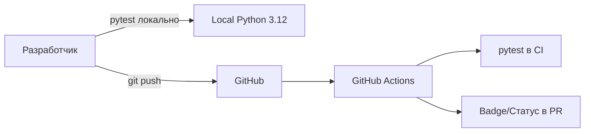

# Test Environment — Тестовое окружение для InvestCalc

Документ описывает, **в каком окружении запускаются тесты** проекта InvestCalc,  
какие инструменты используются и какими командами выполнять тестирование.

---

## 1. Цели документа

- Унифицировать запуск тестов для всех участников команды.
- Минимизировать ошибки вида «у меня работает, у него нет».
- Зафиксировать версии инструментов (Python, pytest и т.д.).
- Связать локальное окружение с CI (GitHub Actions).

---

## 2. Общая схема окружения

Используются три основных варианта:

1. **Локальный запуск на машине разработчика** (Python + pytest).
2. **Запуск тестов внутри Docker-контейнера.**
3. **Запуск тестов в CI (GitHub Actions).**

---

## 3. Окружение разработчика (локальный запуск)

### 3.1. Требования

- Python: **3.12** (рекомендуемая версия для проекта).
- pip (последняя версия).
- Установленные зависимости из `requirements.txt`.

## 3.2. Установка зависимостей

Из корня проекта:

```bash
python -m pip install --upgrade pip
pip install -r requirements.txt
pip install pytest
```

(При желании можно добавить `pytest-cov` для покрытия.)

## 3.3. Запуск всех тестов

```bash
pytest
```

или с более тихим выводом:

```bash
pytest -q
```

Запуск только тестов сервисного слоя:

```bash
pytest tests/test_service.py
```

Запуск только API-тестов:

```bash
pytest tests/test_api.py
```

---

## 4. Тестовое окружение в Docker

### 4.1. Использование Docker для тестирования

Вариант 1 — запуск тестов **внутри образа** (на этапе сборки или вручную):

```bash
docker build -t investcalc-test -f devops/Dockerfile .
docker run --rm investcalc-test pytest
```

Вариант 2 — отдельный Dockerfile/target для тестов (можно реализовать в будущем).

---

## 5. Тестовое окружение в CI (GitHub Actions)

Основные шаги, выполняемые в CI (см. `ci-cd.md`):

1. Checkout репозитория.
2. Установка Python 3.12.
3. Установка зависимостей.
4. Запуск `pytest`.

Пример (фрагмент `build.yml`):

```yaml
- name: Install dependencies
  run: |
    python -m pip install --upgrade pip
    pip install -r requirements.txt
    pip install pytest

- name: Run tests
  run: |
    pytest -q
```

---

## 6. Тестовые данные и фикстуры

* Базовые входные данные для сценариев могут храниться в:

  * `data/input-local.json`
  * `data/input-cloud.json`
* Дополнительные тестовые данные для тестов можно хранить в:

  * `tests/data/` (рекомендуется, если объём возрастает).

Фикстуры pytest (если используются):

* Описываются в `tests/conftest.py`.
* Могут предоставлять «эталонные» сценарии, результаты и т.п.

---

## 7. Диаграмма потока тестирования (учебная схема)


 
