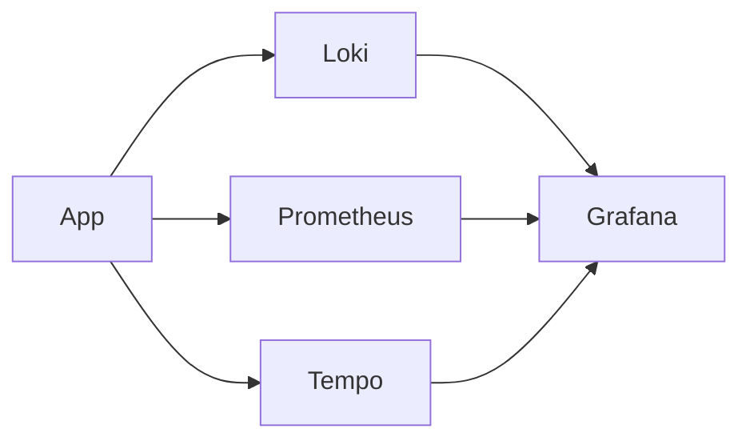

# Observability — Наблюдаемость InvestCalc

Документ описывает три столпа observability: логи, метрики и трассировка.

---

## 1. Логи

- структурированные JSON-логи
- уровни: INFO, ERROR, WARNING
- сбор через Docker/Kubernetes

---

## 2. Метрики

Prometheus:

- http_request_duration_seconds  
- http_requests_total  
- python_gc_*  
- custom metrics (например, количество расчётов)

---

## 3. Трассировка

Добавить OpenTelemetry:

```bash
pip install opentelemetry-sdk opentelemetry-instrumentation-fastapi
```

---

## 4. Stack наблюдаемости

* Prometheus (+ node_exporter)
* Grafana (dashboards)
* Tempo/Jaeger (tracing)
* Loki (logs)

---

## 5. Диаграмма Observability Stack




