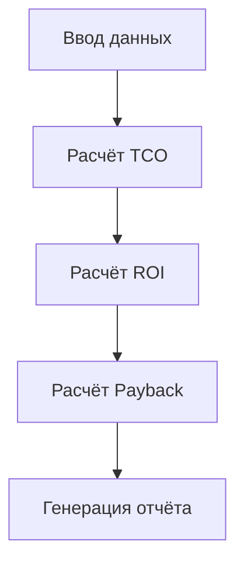

# Report Structure — Структура итогового отчёта InvestCalc

Документ содержит формальные требования к структуре итогового отчёта по проекту.
Отчёт используется для защиты учебного проекта, промежуточной аттестации или участия в командной работе.

---

## 1. Титульный лист

Обязательно:

- название проекта: «InvestCalc — Инвестиционный Аналитик ИС»;
- ФИО участников команды;
- группа, образовательная программа;
- преподаватель/руководитель;
- год выполнения.

---

## 2. Аннотация

Краткое описание проекта (5–7 предложений):

- цель проекта;
- для кого создаётся система;
- что может рассчитывать;
- какие технологии использует;
- какой формат результата.

---

## 3. Введение

Включает:

- предметную область;
- бизнес-проблему;
- обоснование разработки;
- цели и задачи проекта;
- границы системы.

---

## 4. Исходные данные

- структура входных JSON-файлов;
- используемые параметры CAPEX, OPEX, эффектов;
- допущения и ограничения.

---

## 5. Модель расчётов

### 5.1. Формулы

- TCO  
- ROI  
- Payback Period  
- Чувствительность (±20%)  

### 5.2. Диаграмма (mermaid)



---

## 6. Архитектура решения

Включает:

* C4-model (context, container, component);
* предметную модель;
* структуру API;
* структуру кода.

---

## 7. Реализация

* описание модулей FastAPI;
* структура сервиса;
* обработка ошибок;
* описание ключевых функций.

---

## 8. Анализ чувствительности

* таблицы low/base/high;
* графики/диаграммы;
* интерпретация результатов.

---

## 9. Сравнение сценариев

* методика сравнения;
* критерии (ROI, TCO);
* выводы.

---

## 10. Docker и DevOps

Указать:

* как собирается Docker-образ;
* CI/CD;
* healthchecks;
* базовый мониторинг.

---

## 11. Выводы

* экономическая эффективность;
* ограничения модели;
* направления развития.

---

## 12. Приложения

* OpenAPI-spec;
* MERMAID-диаграммы;
* пример отчёта;
* тест-кейсы;
* JSON-файлы.

```
