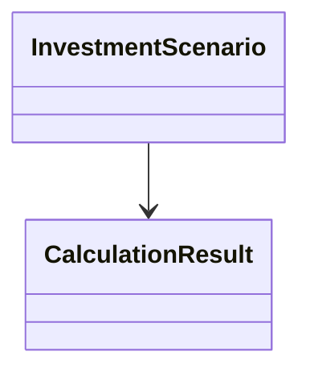

## Report Template — Шаблон итогового отчёта (Markdown)

Ниже приведён готовый шаблон отчёта.  
Команда может заполнять его прямо в Markdown или использовать для генерации PDF.

---

## Титульный лист

**Проект:** InvestCalc — Инвестиционный Аналитик ИС  
**Команда:** <вставить ФИО>  
**Группа:** <группа>  
**Руководитель:** <ФИО>  
**Год:** <год>

---

## Аннотация

<краткое описание проекта>

---

## 1. Введение
- цель проекта;  
- актуальность;  
- задачи;  
- границы системы.  

---

## 2. Предметная область
- сущности;  
- связи;  
- mermaid-диаграмма;  



---

## 3. Требования

* функциональные;
* нефункциональные;
* расширения.

---

## 4. Архитектура

* C4 context;
* container;
* component;

---

## 5. Реализация

* FastAPI;
* структура src;
* обработка ошибок.

---

## 6. Тестирование

* стратегия;
* тест-кейсы;
* результаты.

---

## 7. Расчёты и анализ

* TCO;
* ROI;
* Payback;
* чувствительность.

---

## 8. DevOps

* Docker;
* CI/CD;
* monitoring/logging.

---

## 9. Выводы

* эффективность;
* преимущества;
* ограничения;
* планы развития.

---

## Приложения

* OpenAPI;
* JSON-сценарии;
* примеры отчётов;
* диаграммы.

```
