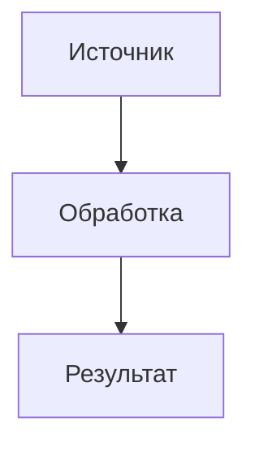

## Шаблон ADR (MADR-стиль)

## 1. Контекст и постановка задачи
Кратко опишите, в каком контексте принимается решение, какие есть исходные данные, ограничения, заинтересованные стороны.

## 2. Движущие факторы решения
- Фактор 1
- Фактор 2
- Фактор 3

## 3. Рассматриваемые варианты
### Вариант A
Описание варианта A.

### Вариант B
Описание варианта B.

### Вариант C
Описание варианта C.

## 4. Принятое решение
Опишите, какой вариант выбран и почему.

## 5. Положительные последствия
Опишите, какие преимущества даёт выбранное решение.

## 6. Отрицательные последствия
Опишите возможные риски и недостатки.

## 7. Плюсы и минусы вариантов
Систематизируйте сравнительный анализ по вариантам.

## 8. Связанные решения
- ADR-XX: ...

## 9. Диаграмма (Mermaid)

## 10. Источники и стандарты
Перечислите ГОСТ, ISO, RFC, внутренние регламенты.
