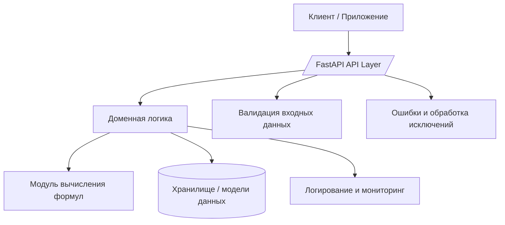
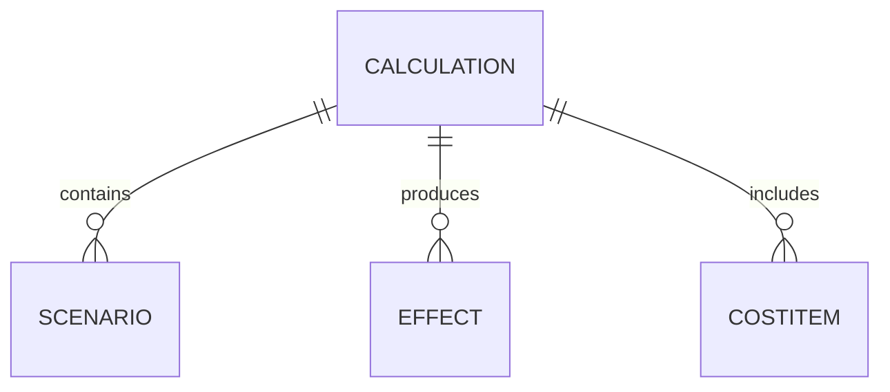

## **Обзор архитектуры системы (Architecture Overview)**

Документ описывает архитектурное видение, ключевые компоненты, взаимодействия между ними и основные технические решения проекта.

---

## **1. Назначение документа**

Этот документ предназначен для:

* описания общей архитектуры системы;
* определения ключевых подсистем;
* объяснения, как система устроена на концептуальном уровне;
* документирования архитектурных решений (ссылки на ADR);
* упрощения входа новых участников команды (студентов).

---

## **2. Контекст проекта**

**Название системы:**
InvestCalc — мини-информационная система для расчёта TCO, ROI, Payback Period и анализа чувствительности.

**Основная цель:**
Предоставить удобный инструмент для анализа экономической эффективности внедрения информационных систем, интегрировать учебный опыт студентов с реальными практиками разработки.

**Тип системы:**

* Web API
* Статeless
* REST
* JSON-only

**Пользователи системы:**

* студенты (разработчики);
* преподаватели (проверка результатов);
* внешние клиенты (опционально, для расширенной версии).

---

## **3. Общая архитектурная структура**

Архитектура основана на принципах:

* модульный монолит (ADR-02),
* разделение на слои (ADR-03),
* чистая структура API и доменной логики,
* прозрачность поведения (логирование, наблюдаемость).

Основные слои:

1. **API Layer**

   * обработка HTTP-запросов
   * сериализация
   * валидация входных данных
   * маршрутизация

2. **Domain Layer**

   * сущности и модели бизнес-логики
   * расчёт TCO/ROI/PP
   * анализ чувствительности

3. **Service Layer**

   * хранилища данных
   * вспомогательные сервисы
   * внешние интеграции

4. **Infrastructure Layer**

   * настройки
   * конфигурации
   * адаптеры

---

## **4. Диаграмма архитектуры (уровень Container — C4)**

*(Можно заменить диаграмму своей в дальнейшем)*

---

## **5. Модель данных (высокоуровневая)**

Основные сущности:

* **Calculation** — расчёт TCO/ROI/PP
* **Scenario** — сценарий анализа чувствительности
* **Effect** — экономический эффект
* **CostItem** — элементы расходов (CAPEX/OPEX)

Связи:

---

## **6. Потоки данных**

**Входящие потоки:**

* JSON-запросы пользователей
* параметры расчёта
* сценарии чувствительности

**Исходящие потоки:**

* результаты расчётов
* JSON-ответы API
* отчёты и метрики

---

## **7. Используемые технологии**

| Область      | Технологии                |
| ------------ | ------------------------- |
| Backend      | Python 3.12, FastAPI      |
| Контракты    | Pydantic                  |
| Документация | OpenAPI 3.1, MkDocs       |
| Тестирование | pytest, httpx             |
| DevOps       | Docker, GitHub Actions    |
| Безопасность | OWASP API Security Top 10 |

---

## **8. Нефункциональные требования (сводная таблица ISO/IEC 25010)**

| Характеристика         | Требование                                             |
| ---------------------- | ------------------------------------------------------ |
| Надёжность             | Обработка ошибок стандартизирована (ADR-12)            |
| Удобство сопровождения | Чёткий набор ADR + структурированный код               |
| Производительность     | Время отклика до 200мс                                 |
| Переносимость          | Docker-совместимая архитектура                         |
| Безопасность           | Валидация, ограничение payload, безопасное логирование |

---

## **9. Основные ADR, влияющие на архитектуру**

* ADR-01 — Архитектурное видение
* ADR-02 — Архитектурный стиль
* ADR-03 — Структура домена
* ADR-04 — Технологический стек
* ADR-06 — Архитектура вычислительного ядра
* ADR-12 — Ошибки API
* ADR-15 — Модель безопасности
* ADR-20 — CI/CD
* ADR-21 — Docker

---

## **10. Требования к качеству архитектуры**

Архитектура должна соответствовать:

* ISO/IEC/IEEE 42010 (описание архитектуры)
* ISO/IEC 25010 (качество)
* ГОСТ 34.602–2020 (описание требований)
* OWASP API Security Top 10

---

## **11. Ограничения**

* API работает только с JSON
* Нет постоянной базы данных (в учебной версии)
* Расчёты должны быть воспроизводимыми
* Отсутствие внешних интеграций в базовой версии

---

## **12. Риски и способы их минимизации**

| Риск                        | Мера                          |
| --------------------------- | ----------------------------- |
| Ошибки при расчётах         | модульное тестирование формул |
| Несогласованная архитектура | ведение ADR-реестра           |
| Сложность для студентов     | модульный монолит + шаблоны   |
 
