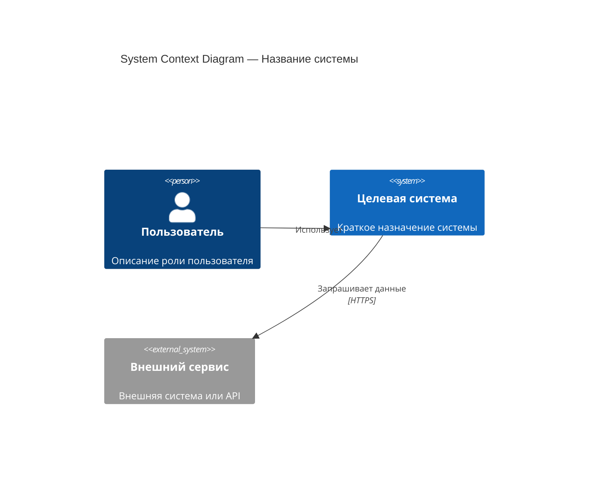
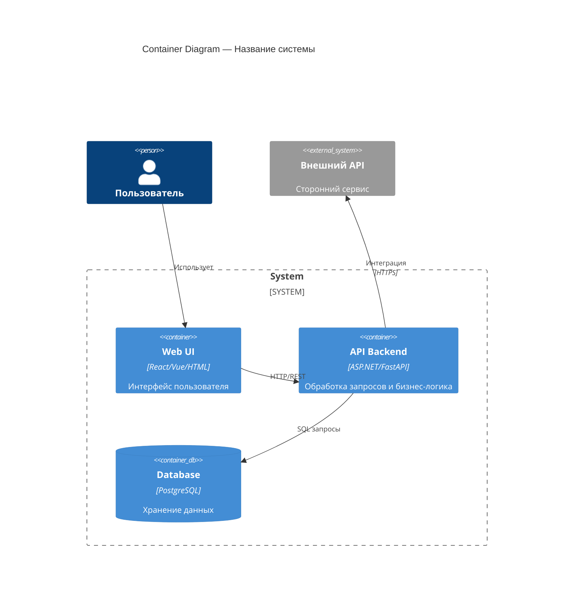
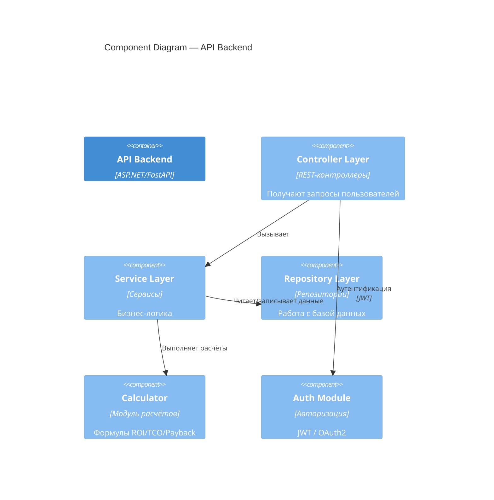
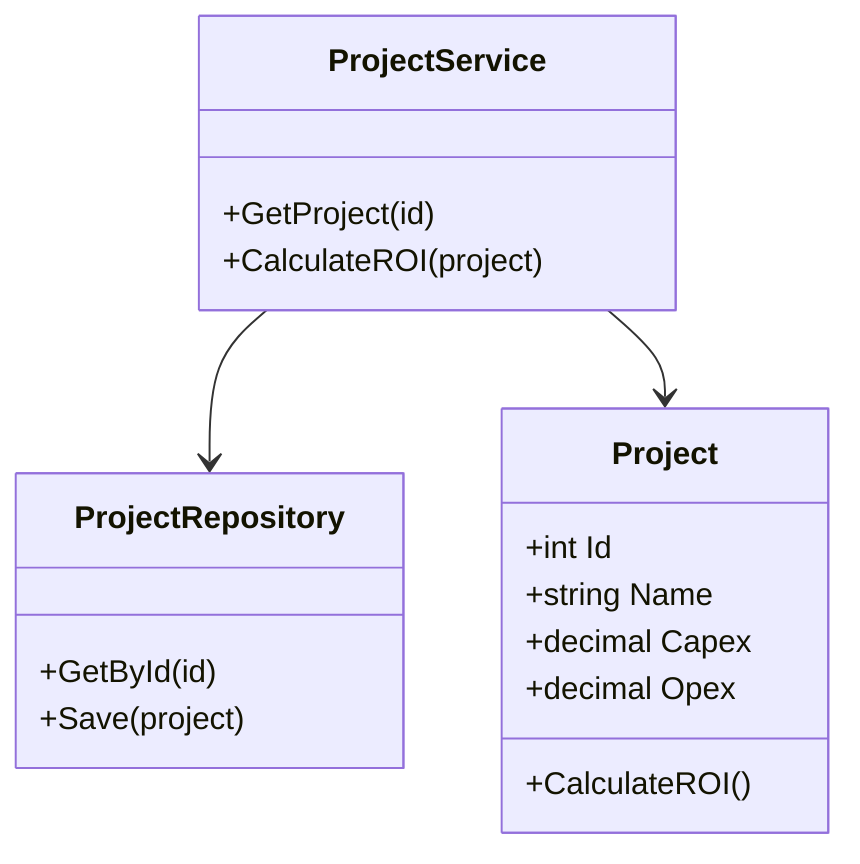

## C4 Model — Шаблон документации архитектуры
(Система визуального моделирования архитектуры: Context → Container → Component → Code)

Документ описывает архитектуру системы на основе модели C4, включая 4 уровня диаграмм и текстовое архитектурное описание.

---

## 1. Цель документа
Кратко опишите:

- назначение архитектуры;
- для кого документ (разработчики, архитекторы, заказчик);
- что отражает модель (контекст, контейнеры, компоненты, код).

---

## 2. Уровень 1 — Context Diagram (Контекст системы)

## 2.1. Описание
Опишите систему на уровне **взаимодействия с внешними участниками**:

- пользователи,
- внешние системы,
- каналы интеграции,
- назначение вашей системы в экосистеме.

## 2.2. Диаграмма (Mermaid)

## 2.3. Таблица участников

| Имя            | Тип             | Описание                       | Взаимодействие |
| -------------- | --------------- | ------------------------------ | -------------- |
| Пользователь   | Person          | Человек, работающий с системой | Ввод данных    |
| Внешний сервис | System External | Поставщик данных               | API запросы    |

---

## 3. Уровень 2 — Container Diagram

## 3.1. Описание

Опишите **большие части системы**:

* Backend (API, Application)
* Frontend (Web/Mobile)
* Database
* External APIs
* Message queues

## 3.2. Диаграмма (Mermaid)

## 3.3. Таблица контейнеров

| Контейнер   | Технологии        | Назначение     |
| ----------- | ----------------- | -------------- |
| Web UI      | React/Vue         | Интерфейс      |
| API Backend | ASP.NET / FastAPI | Логика системы |
| Database    | PostgreSQL        | Данные         |

---

## 4. Уровень 3 — Component Diagram

## 4.1. Описание

Здесь описываются **крупные модули внутри контейнера API**:

* Controllers / Endpoints
* Services
* Repositories
* Calculators (для InvestCalc)
* Integrations
* Auth module
* Logging module

## 4.2. Диаграмма (Mermaid)

## 4.3. Таблица компонентов

| Компонент  | Назначение              | Примечания            |
| ---------- | ----------------------- | --------------------- |
| Controller | Обработка HTTP запросов | REST API              |
| Service    | Основная логика         | Отделяет UI от логики |
| Repository | CRUD операции           | PostgreSQL            |
| Calculator | Сложные вычисления      | Для InvestCalc        |
| Auth       | Безопасность            | JWT                   |

---

## 5. Уровень 4 — Code / Class Diagram (по необходимости)

## 5.1. Описание

Используется при детальной реализации:

* классы;
* интерфейсы;
* связи;
* DTO;
* сущности БД.

## 5.2. Диаграмма (Mermaid)

---

## 6. Нефункциональные требования (по стандарту C4 + ISO 25010)

* масштабируемость
* безопасность
* надежность
* журналирование
* производительность
* развертывание (Docker)
* версионирование API

---

## 7. Ограничения и допущения

Привести:
– технические ограничения,
– бизнес-ограничения,
– инфраструктурные ограничения.

---

## 8. Ссылки

* Архитектура проекта (index.md)
* ADR решения
* API спецификация
* ER-диаграмма БД
* README

