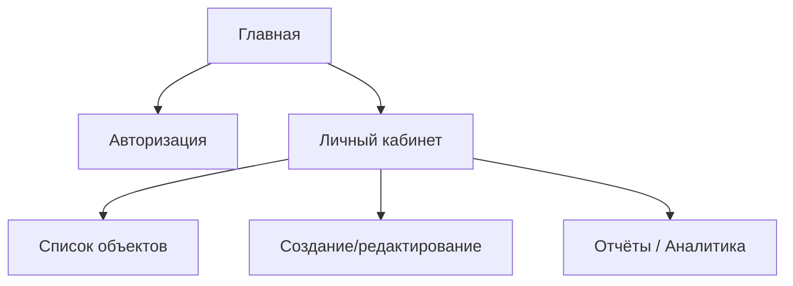
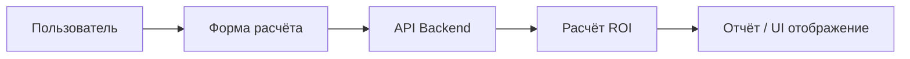

## UI Prototype — Шаблон документа
(Документирование пользовательского интерфейса, UX и прототипов)

Проект: ____________________________________________  
Версия: _____________________________________________  
Дата: ______________________________________________  
Автор: _____________________________________________  

---

## 1. Введение

## 1.1. Назначение документа
Документ описывает пользовательские интерфейсы системы, их структуру, навигацию, логику работы и основные UX-решения. Используется для согласования дизайна с заказчиком и для передачи команды разработки.

## 1.2. Используемые инструменты
- Figma / Penpot / Adobe XD  
- Draw.io / Whimsical  
- GitHub Pages / MkDocs  
- Style guide (если есть)

Ссылка на прототип Figma: ________________________________________

---

## 2. Общие принципы UX/UI

## 2.1. Основные цели интерфейса
- простота и понятность;  
- минимальное количество шагов в сценариях;  
- единый визуальный стиль;  
- адаптивность (мобильная/планшет/desktop);  
- доступность (контраст, размеры шрифтов, подсказки).

## 2.2. Пользовательские роли
Опишите ключевых актёров:

- Гость / Неавторизованный пользователь  
- Пользователь / Клиент  
- Администратор  
- Менеджер (для CRM/ServiceDesk)

---

## 3. Архитектура интерфейсов (UI Information Architecture)

## 3.1. Карта экранов (Sitemap)
*(Можно вставить Mermaid диаграмму.)*



## 3.2. Основная структура навигации

* Верхнее меню / боковое меню
* Хлебные крошки
* Навигация между разделами
* Быстрые действия (меню, кнопки, шорткаты)

---

## 4. Описание экранов

## Формат описания экрана:

```
Название экрана  
ID: UI-XX  
Цель:  
Пользовательский сценарий:  
Состав элементов:  
  - поля  
  - кнопки  
  - таблицы  
  - фильтры  
  - ошибки/валидация  
Описание логики поведения:  
Ссылки на макеты:  
```

---

## 4.1. Экран: Авторизация

ID: UI-01
**Цель:** вход пользователя в систему.
**Элементы:**

* Поле Email
* Поле Password
* Кнопка "Войти"
* Ссылка "Забыли пароль?"

**Поведение:**

* При неверных данных — сообщение об ошибке
* При успешном входе — переход в личный кабинет

**Макет Figma:** _________________________________

---

## 4.2. Главная / Dashboard

ID: UI-02
**Цель:** показать ключевую информацию пользователю.

**Элементы:**

* Статистика (карточки)
* Кнопка “Создать объект”
* Список последних действий

**Логика:**

* Данные обновляются динамически
* Карточки кликабельны

---

## 4.3. Список сущностей (например, Клиенты / Проекты / Заявки)

ID: UI-03
**Цель:** работа со списками элементов.

**Элементы:**

* Таблица с данными
* Поиск / фильтры
* Пагинация
* Кнопка “Добавить”

**Поведение:**

* Клик по строке → просмотр/редактирование
* Фильтры обновляют таблицу без перезагрузки

---

## 4.4. Форма создания / редактирования

ID: UI-04
**Цель:** ввод данных пользователем.

**Элементы формы:**

* Поля ввода
* Выпадающие списки
* Переключатели
* Поля с валидацией

**Логика:**

* Проверка обязательных полей
* Подсказки и описания
* Ошибки полей отображаются inline

---

## 4.5. Экран аналитики или отчёта (для InvestCalc)

ID: UI-05

**Элементы:**

* Графики
* Карточки KPI
* Результаты расчётов (ROI, TCO, PP)

**Поведение:**

* Обновление при изменении входных данных
* SEO-friendly и копирование данных

---

## 5. Прототипы (Wireframes / Mockups)

Разместите миниатюры экранов или ссылки на исходники.

```

```

Примеры:

* Авторизация
* Dashboard
* Таблица данных
* Карточка объекта
* Форма создания
* Модальные окна

---

## 6. Стили и гайдлайн (UI Style Guide)

## 6.1. Цветовая палитра

* Primary: ##______
* Secondary: ##______
* Accent: ##______
* Background: ##______
* Error: ##______

## 6.2. Типографика

* Основной шрифт: ________
* Размеры: заголовки, текст, подписи

## 6.3. Компоненты

* Кнопки (primary/secondary/outlined)
* Поля ввода
* Модальные окна
* Таблицы
* Карточки

---

## 7. Поведение интерфейса (UI Logic & UX Behavior)

## 7.1. Валидация

* обязательные поля
* формат email/телефона
* числовые ограничения

## 7.2. Ошибки и уведомления

* toast/snackbar
* inline-ошибки
* ошибки API

## 7.3. Загрузки и состояния

* skeleton loaders
* preloader
* empty states

---

## 8. Сценарии использования (User Flows)



---

## 9. Требования к адаптивности

* desktop ≥ 1280px
* tablet 768–1024px
* mobile ≤ 480px

---

## 10. Приложения

* все экраны;
* дополнительные макеты;
* примеры состояний;
* альтернативные варианты дизайна.

