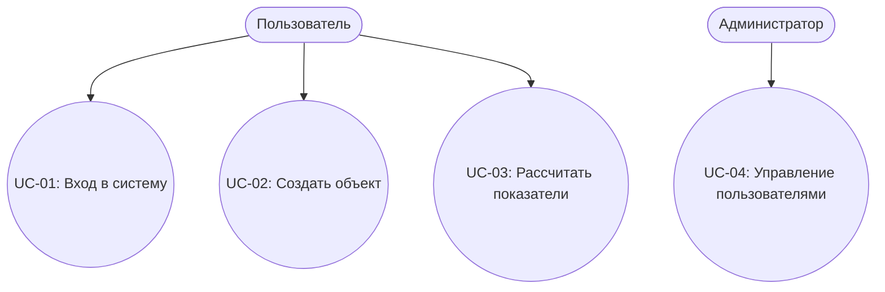

# Use Case Specification — Шаблон
(Спецификация вариантов использования UML / ISO/IEC/IEEE 29148)

Проект: _______________________________________________  
Версия документа: _______________________________________  
Дата: _________________________________________________  
Автор: ________________________________________________  

---

## 1. Введение

### 1.1. Назначение документа
Документ описывает варианты использования системы (Use Cases), определяет взаимодействие актёров с системой и формализует бизнес-сценарии.

### 1.2. Актёры (Actors)
Список ключевых ролей, взаимодействующих с системой:

| Актёр | Описание |
|-------|----------|
| Пользователь | Основной пользователь системы |
| Администратор | Управляет настройками, доступами |
| Внешняя система | API или интеграция |

---

## 2. Диаграмма вариантов использования (Use Case Diagram)
 



---

## 3. Шаблон описания Use Case

Используйте этот блок для каждого сценария:

```
UC-XX — Название варианта использования  
Версия: 1.0  
Актёры: перечислите роли  
Цель: чего актёр хочет достичь  
Краткое описание: 2–3 предложения  

Предусловия:
- что необходимо до начала сценария  

Постусловия:
- что становится истинным после выполнения сценария  

Основной поток (Main Flow):
1. …
2. …
3. …
4. …

Альтернативный поток (Alternative Flow A1):
A1.1. …
A1.2. …

Исключения / Ошибки:
E1: …
E2: …

Триггер:
- событие, запускающее сценарий  

Связанные требования:
- FR-XX
- NFR-XX  
```

---

## 4. Примеры Use Cases

Ниже приведены примеры, которые остаются в шаблоне (можно удалить при использовании).

---

### UC-01 — Вход в систему

**Актёры:** Пользователь
**Цель:** получить доступ к личному кабинету
**Краткое описание:** Пользователь вводит логин и пароль, система проверяет данные и предоставляет доступ.

**Предусловия:**

* пользователь зарегистрирован
* система доступна

**Постусловия:**

* пользователь авторизован

**Основной поток:**

1. Пользователь открывает страницу авторизации.
2. Вводит логин и пароль.
3. Система проверяет данные.
4. Система открывает личный кабинет.

**Альтернативный поток A1 (неверный пароль):**

1. Система отображает сообщение об ошибке.
2. Пользователь может повторить попытку.

**Исключения:**

* E1: Сервис авторизации недоступен → ошибка.

---

### UC-02 — Создать объект (запись, проект, клиента)

**Актёры:** Пользователь
**Цель:** добавить новую запись в систему

**Основной поток:**

1. Пользователь нажимает кнопку “Добавить”.
2. Заполняет форму.
3. Система проверяет введённые данные.
4. Сохраняет объект.
5. Показывает обновлённый список.

**Альтернативные потоки:**

* A1: Некорректные данные → ошибки валидации
* A2: Пользователь отменяет действие

---

### UC-03 — Выполнить расчёт (для InvestCalc)

**Актёры:** Пользователь
**Цель:** получить значения ROI/TCO/Payback

**Основной поток:**

1. Пользователь вводит CAPEX/OPEX.
2. Нажимает кнопку “Рассчитать”.
3. Система вычисляет показатели.
4. Выводит результат и графики.

**Исключения:**

* E1: CAPEX ≤ 0 → ошибка валидации
* E2: отсутствует интернет (если API внешнее)

---

## 5. Требования к Use Case модели

* каждый UC должен быть проверяемым;
* UC описывает поведение системы, а не UI;
* UC должен отражать одно законченное действие;
* связи UC ↔ требования должны быть прозрачными;
* UC служат основой для тест-кейсов (TC).

---

## 6. Трассировка (Traceability Matrix)

| Use Case | Связанные требования | Связанные Test Cases   |
| -------- | -------------------- | ---------------------- |
| UC-01    | FR-01, NFR-02        | TC-AUTH-01, TC-AUTH-02 |
| UC-02    | FR-03                | TC-CRUD-01             |
| UC-03    | FR-04                | TC-CALC-01, TC-CALC-02 |

---

## 7. Приложения

* диаграммы (C4, UML Use Case)
* прототипы UI (для понимания сценариев)
* API примеры (если UC связан с backend)
